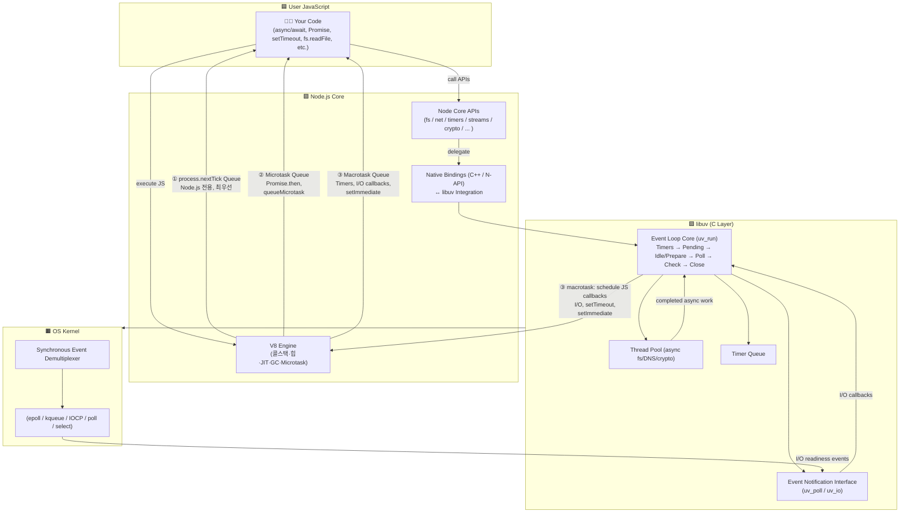
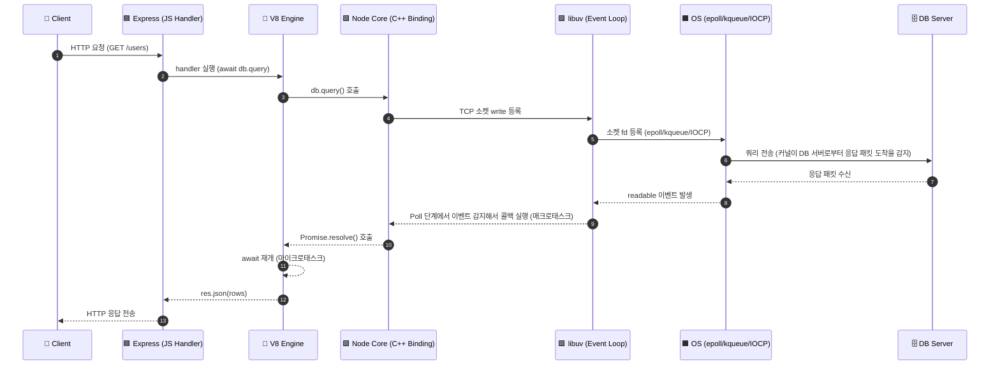
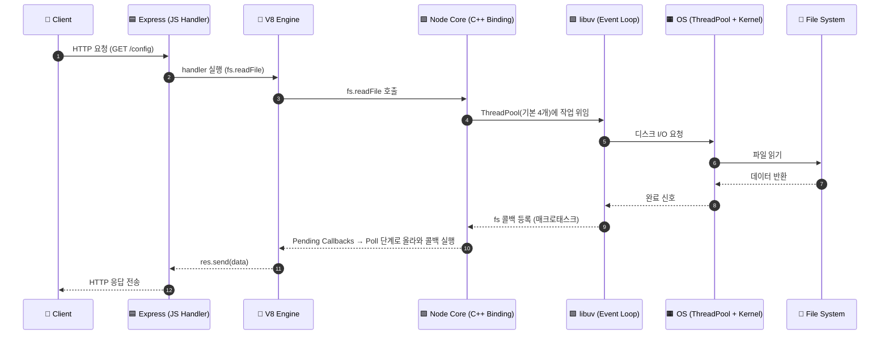
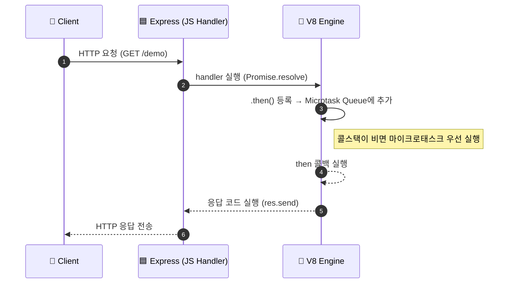
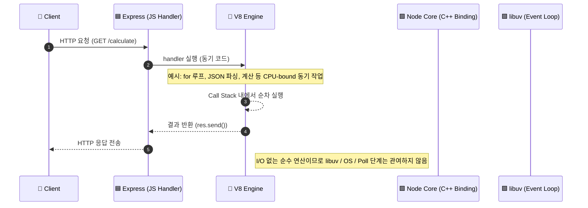

### Synchronous Event Demultiplexer
OS 커널이 여러 I/O 소켓(파일 디스크립터)을 동시에 감시하면서, 어떤 I/O가 준비됐는지 알려주는 역할을 하는 시스템 콜 계층

epoll, kqueue, poll같은 POSIX 시스템 콜

### Event Notification Interface
OS에 이벤트를 등록/통지하는 API 계층

uv_poll, uv_io 같은 libuv API

### Event Loop
이벤트 큐를 감시하고, 준비된 I/O 이벤트에 대한 콜백을 실행하는 루프

Node.js의 비동기 실행 모델

# 동작 원리 총 정리

# node.js 예제별 실행 흐름

1. 일반적인 DB I/O 흐름

- DB I/O는 libuv Poll 단계에서 깨어나고, Promise resolve는 V8 마이크로태스크로 처리됨.

2. File I/O 흐름

- File I/O는 epoll이 아니라 libuv 스레드풀을 통해 비동기로 처리되고, 완료 콜백은 매크로태스크 큐에 등록된다.

3. Promise 처리 방식

4. 일반적인 JS 코드 실행

### N-API
Node.js에서 C/C++로 작성된 네이티브 애드온(addon)을 만들기 위한 API

Node.js 내부 ABI(Application Binary Interface)를 추상화해서 안정적인 인터페이스를 제공

JS에서 C/C++ 함수를 직접 호출할 수 있고, C/C++ 코드가 JS 객체를 조작하거나 이벤트를 발생시킬 수도 있음.

이걸 통해 고성능 네이티브 라이브러리(예: 이미지 처리, 암호화, 머신러닝 등)를 Node.js 환경 안에서 그대로 쓸 수 있게 됨.

### WASM (WebAssembly)
바이너리 코드 형식이자 저수준 어셈블리-유사 언어로, JS VM 환경에서 언어 중립적으로 실행될 수 있게 설계.

C, C++, Rust 등 컴파일해서 WASM 모듈로 만들 수 있고, 이 모듈이 JS와 같이 실행되거나 JS 환경 안에서 함께 작동할 수 있음.

JS보다는 더 저수준이기 때문에 거의 네이티브(native) 성능에 가까운 실행 속도가 가능

이미 C/C++, Rust 등으로 작성된 코드들을 웹 혹은 JS 환경으로 옮기기 쉬움.

WASM 모듈은 플랫폼 독립적으로 설계되어 있고, 메모리 모델 등이 엄격히 정의돼 있어 보안/이식 측면에서도 유리

기존 JS 코드와 함께 사용할 수 있게 설계되어 있음.

아무 문제 없이 JS보다 항상 빠른 건 아니고, 초기 로딩이나 인스턴스화 비용, 메모리 접근 방식 차이 등이 성능에 영향을 줄 수 있음.

### Node.js에서 N-API와 WASM의 역할 비교
N-API는 Node.js 안으로 네이티브 코드를 끌어들이는 내부 통합 브릿지, WASM은 Node.js 밖에서도 돌아가는 보안 샌드박스 실행 포맷

| 구분            | **N-API**                                             | **WASM (WebAssembly)**                                             |
|---------------|-------------------------------------------------------|--------------------------------------------------------------------|
| **정의**        | Node.js에서 C/C++ 코드를 직접 연결하기 위한 **Native Addon 인터페이스** | C/C++/Rust 등의 코드를 **브라우저나 Node.js 런타임에서 실행 가능한 바이트코드 포맷**으로 컴파일한 것 |
| **주요 목적**     | JavaScript ↔ 네이티브 코드(C/C++) 간의 직접 브릿지 제공              | 언어 독립적인, 안전하고 이식 가능한 실행 포맷 제공                                      |
| **런타임 통합 방식** | Node.js 내부의 `N-API` 모듈을 통해 JS에서 C++ 함수를 직접 호출         | JS에서 `WebAssembly.instantiate()`로 `.wasm` 모듈을 불러 실행                |
| **실행 환경**     | Node.js 전용                                            | Node.js, Deno, 브라우저, Cloudflare Workers 등 **크로스 플랫폼**              |
| **성능**        | 완전 네이티브 성능 (C/C++ 수준)                                 | 거의 네이티브급이지만, 샌드박싱과 메모리 모델 때문에 약간 낮음                                |
| **보안/격리**     | JS와 메모리를 직접 공유 → 보안은 개발자 책임                           | 샌드박스 환경에서 실행 → 안전하지만 직접 메모리 접근 불가                                  |
| **배포 형태**     | 플랫폼별 바이너리(`.node` 파일) 필요                              | 플랫폼 독립적 `.wasm` 파일 하나로 배포 가능                                       |
| **대표 사용처**    | 고성능 네이티브 라이브러리 연동 (예: 데이터베이스 드라이버, OpenSSL, 이미지 처리 등) | 멀티런타임 호환 모듈 (예: Prisma, TensorFlow.js, Web codecs, Edge compute 등) |

### Prisma에서 WASM을 쓴 이유 및 Rust 제거 배경
이전까지 Prisma ORM은 쿼리를 처리하는 핵심 엔진 부분이 Rust로 작성되어 있는 query engine이었음.

이 엔진은 빠른 속도, 안정성 등의 이유로 Rust로 구현됨.

Prisma 팀은 Rust-Free 버전을 발표. 즉, 더 이상 쿼리 엔진을 Rust 바이너리 형태로 배포하지 않고, WASM 모듈 + TypeScript 층으로 대체.

Query Compiler 프로젝트로 Rust 엔진 일부를 WASM 모듈 + TypeScript로 바꿔서 배포 사이즈를 줄이고, 호환성(웹/브라우저/서버 등)도 강화.

왜?
- Rust 바이너리를 각 플랫폼(Windows/Linux/macOS)마다 제공해야 했고, 그것이 설치/배포 부담으로 작용
- WASM 모듈 하나로 여러 환경을 커버
- Node.js 외에도 Deno, Bun, Cloudflare Workers 등 다양한 JS 런타임 환경에서 동작하게 하려면 Rust-바이너리 방식이 제약이 많았음.
- WASM + TS 방식이 더 런타임 친화적
- 팀이나 커뮤니티의 개발자들이 TypeScript 중심으로 작업하는 경우가 많고, Rust로 작성된 엔진을 여러 플랫폼에서 유지보수하는 비용이 큼
- WASM 모듈 형태로 엔진 기능을 제공하면 외부에서도 쉽게 삽입/교체 가능하고, 다양한 환경에 적응하기 쉬움.

Rust-Free란 말 그대로 더 이상 Rust로 작성된 네이티브 바이너리를 필수로 포함하지 않는다는 뜻

하지만, 완전히 Rust를 안 쓰겠다는 건 아니고 엔진 배포 방식/구조를 바꾼 것

결과적으로, Prisma 사용자는 플랫폼별로 바이너리를 추가로 설치하거나 빌드하는 부담이 줄었고, 웹/서버 환경 모두에서 더 간편
