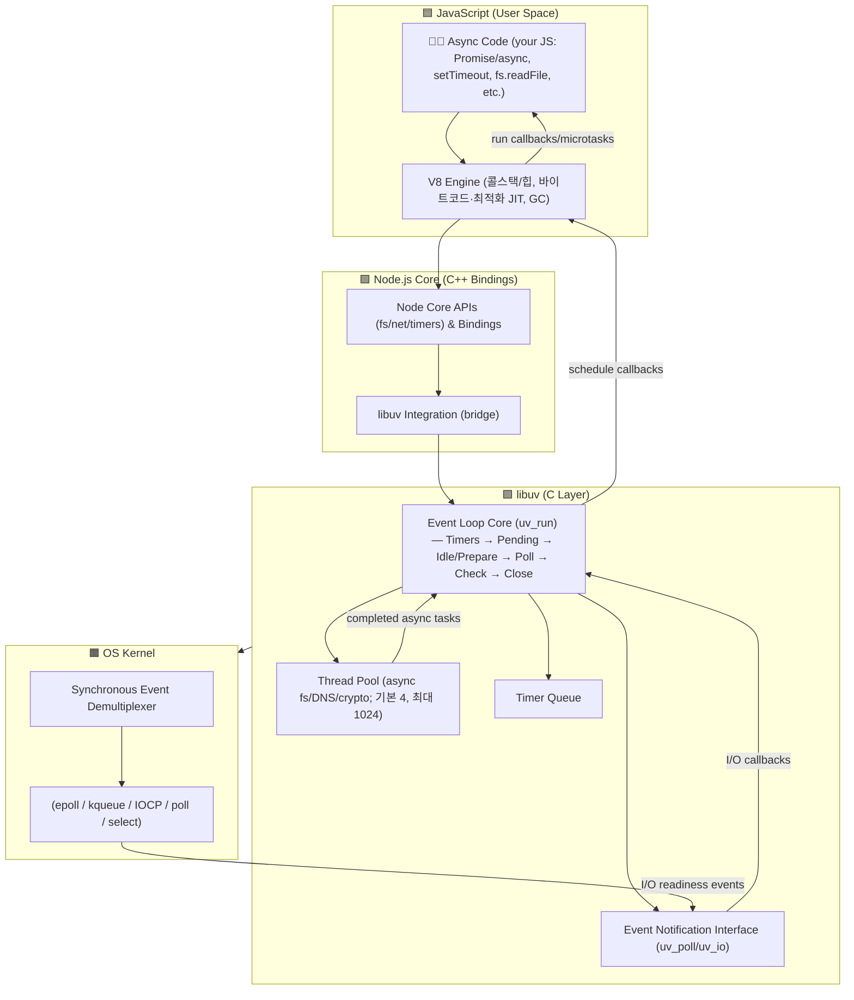

### Synchronous Event Demultiplexer
OS 커널이 여러 I/O 소켓(파일 디스크립터)을 동시에 감시하면서, 어떤 I/O가 준비됐는지 알려주는 역할을 하는 시스템 콜 계층

epoll, kqueue, poll같은 POSIX 시스템 콜

### Event Notification Interface
OS에 이벤트를 등록/통지하는 API 계층

uv_poll, uv_io 같은 libuv API

### Event Loop
이벤트 큐를 감시하고, 준비된 I/O 이벤트에 대한 콜백을 실행하는 루프

JS의 비동기 실행 모델

# 동작 원리 총 정리

# node.js 예제별 실행 흐름

1. 