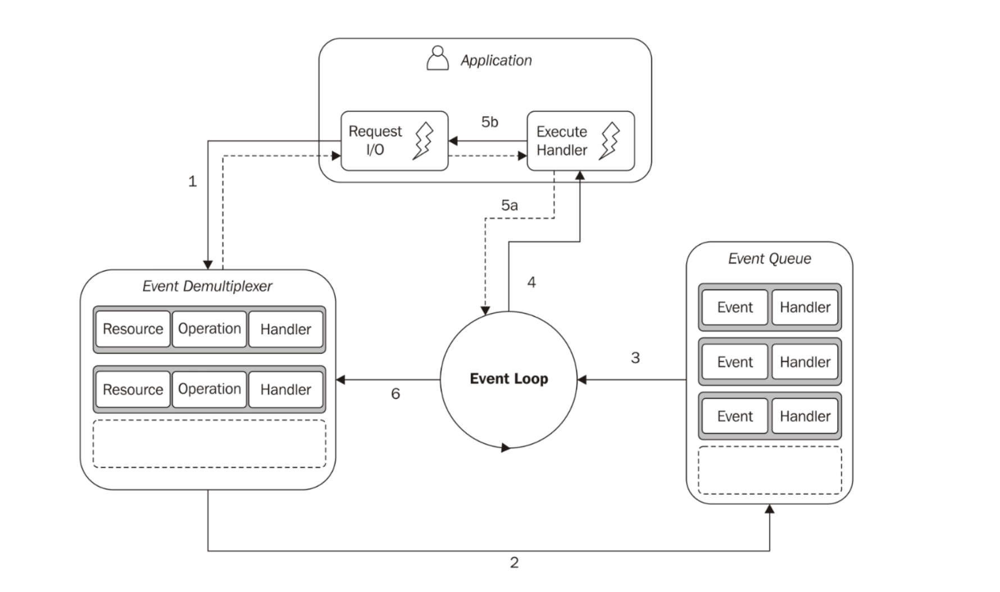

## [1장 - Node.js 플랫폼]

<aside>

- “Node way”: 작고 간단한 최소한의 필요 기능만을 노출한다.
- Refactor 패턴
- 브라우저와 다르게 동작하는 Javascript 의 의미
</aside>

### 1.1 Node.js 철학

- 경량 코어
  - Node.js core는 최소한의 기능을 가진다.
- 경량 모듈
  - 작은 모듈(”각 프로그램은 한 역할만”)을 만들어 재사용한다.
  - 패캐지 관리자를 사용해 각 패키지가 필요로 하는 버전의 종속성 패키지를 갖도록 한다.
- 작은 외부 인터페이스
  - 단일 진입점 제공. 하나의 함수나 클래스만 외부로 노출.
- 간결함과 실용주의
  - 복잡한 클래스 계층 X → 간단한 클래스, 함수, 클로저 사용

### 1.2 Node.js는 어떻게 동작하는가

- Blocking I/O
  - 작업이 완료될 때까지 기다린다.
  - 각각의 동시 연결을 처리하기 위해 개별 스레드와 프로세스를 사용한다.
  - 스레드가 Blocking되어 메모리, CPU 사이클이 낭비된다.
- Non Blocking I/O
  - 작업이 완료될 때까지 기다리지 않고, **즉시 제어권을 반환한다.**
  - Busy waiting 방식
    - 애플리케이션이 루프를 돌며 계속해서 I/O 완료 여부를 직접 확인한다.
    - CPU가 지속적으로 폴링하므로 비효율적이다.
  - 이벤트 디멀티플렉싱 방식
    - 커널이 여러 I/O 리소스를 감시하며 완료된 I/O가 생기면 이벤트로 알려준다.
    - 커널은 이벤트가 발생할 때까지 효율적으로 대기(sleep)하며 JS 스레드는 Block되지 않고 다음 작업을 계속 수행한다.
    - Node.js의 이벤트 루프는 커널로부터 완료 이벤트를 받아 등록된 콜백(핸들러)을 실행한다.
      | 구분 | Busy waiting | Node.js 이벤트 루프 |
      | -------- | ----------------------- | ------------------------------------------------- |
      | JS 코드 | 계속 도는 중 (CPU 낭비) | 즉시 다음 작업 실행 (non-blocking) |
      | 커널 | 상관없음 | 이벤트 대기 중 block (sleep) |
      | CPU 점유 | 100% | 필요할 때만 wake-up |
      | 느낌상 | 무한 루프 | "이벤트가 생기면 반응하는 동기처럼 보이는 비동기" |
- 리액터 패턴

> 관찰 대상 리소스에서 새 이벤트를 사용할 수 있을 때까지 블로킹하여 I/O를 처리하고, 각 이벤트를 관련된 핸들러에 전달함으로써 반응한다.

- 이벤트 디멀티플렉싱 알고리즘을 구현하기 위한 패턴
- I/O 작업에 연관된 핸들러를 갖는다. (⇒ 콜백 함수)
- 동작

  - 애플리케이션 → Demultiplexer 에 요청 전달
  - Demultiplexer → Event Queue에 이벤트 작업을 넣음
  - 이벤트 루프가 이벤트 큐의 항목을 순회
  - 이벤트와 관련된 핸들러 호출
    - 핸들러 실행이 완료되면 제어권을 이벤트 루프에 돌려줌 → 다음에 실행할 핸들러가 있는지 확인
    - 핸들러 실행 중에 다른 비동기 작업 요청할 수 있음 → 이벤트 핸들러 내에서 다른 비동기 작업 요청 가능
  - 이벤트 큐 항목 모두 처리되면 이벤트 루프는 Demultiplexer에서 Blocking

  

- Node.js 구성
  - libuv: 서로 다른 리소스 유형의 논블록킹 동작을 표준화하기 위한 C 라이브러리
  - 바인딩: libuv와 다른 저수준 기능을 랩핑하고 표출하기 위한 바인딩 세트
  - V8: 크롬 브라우저를 위한 Javascript 엔진
  - Core Javascript API: 고수준 Node.js API를 구현

### 1.3 Node.js에서의 Javascript

> 브라우저는 “보안을 위해 제한된 Javascript 환경”,
>
> Node.js는 “운영체제와 직접 상호작용 가능한 Javascript 런타임”

- 브라우저에서 사용하는 Javascript와 다른점
  - DOM을 가지지 않는다.
  - 운영체제에서 기본적으로 제공하는 서비스에 접근이 가능하다. (ex. filesystem)
  - 최신 버전의 V8를 가지고 있기 때문에, 최신 ECMAScript 사양 대부분 사용 가능하다.
  - Node.js의 기본 require()는 로컬 파일 시스템의 모듈만 불러올 수 있다.
  - 네이티브 코드에 바인드할 수 있는 모듈을 만들 수 있다. (기본으로 웹어셈블리 지원)
