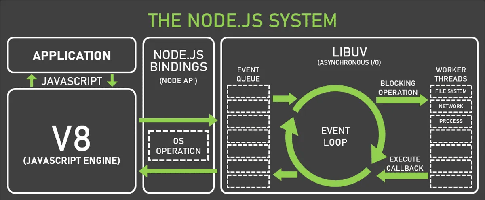
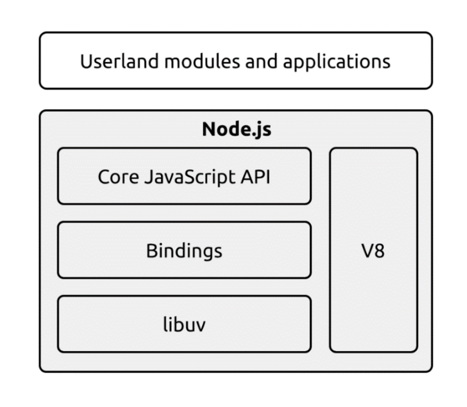

# Node.js는 싱글 스레드일까?



출처: 네이버페이 블로그

## Node.js는 싱글 스레드일까?

보통 Node.js를 싱글 스레드 라고 표현하지만,

정확히 말하면 “**싱글 스레드 이벤트 루프 기반의 멀티 스레드 런타임**”이다.

### Node.js의 구조

Node.js의 구조는 다음과 같이 나눌 수 있다



출처: Node.js 디자인 패턴 바이블

1. V8 - 크롬 브라우저를 위한 Javascript 엔진
2. libuv - 서로 다른 리소스 유형의 논블록킹 동작을 표준화하기 위한 C 라이브러리
3. **이벤트 루프** – 비동기 작업을 큐에 등록하고 콜백을 처리

### libuv 를 통한 비동기 처리

](./images/image4.png)

출처: [https://velog.io/@tennfin1/NodeJS가-Spring보다-빠르다고-쉽게-설명해드림](https://velog.io/@tennfin1/NodeJS%EA%B0%80-Spring%EB%B3%B4%EB%8B%A4-%EB%B9%A0%EB%A5%B4%EB%8B%A4%EA%B3%A0-%EC%89%BD%EA%B2%8C-%EC%84%A4%EB%AA%85%ED%95%B4%EB%93%9C%EB%A6%BC)

Node.js는 V8 엔진 위에서 JavaScript를 **단 하나의 메인 스레드로 실행**한다. 동시에 두 개의 JS 함수가 실행되는 일은 없다.

- Event Loop는 메인 스레드 안에서 실행되며 비동기 callback 작업이 수행될 수 있도록 도와준다.

내부적으로는 libuv C 라이브러리를 통해 비동기 I/O를 관리한다.

- 대부분의 네트워크 I/O는 커널의 이벤트 디멀티플렉서(epoll, kqueue 등)를 통해 처리된다.
- 파일 입출력, DNS.lookup, 암호화, 압축과 같은 블로킹 네이티브 작업은 libuv의 스레드풀에서 병렬로 수행된다.

→ 즉, JavaScript 실행 자체는 한 스레드에서 순차적으로 일어나지만, Node.js 전체는 여러 스레드가 협력해 비동기 동시성(concurrency) 을 구현한다.

### 동작 예시

```jsx
fs.readFile("file.txt", () => console.log("done"));
console.log("next");
```

1. `fs.readFile` 호출 (JS → libuv로 전달)
2. `console.log('next')` 실행
3. 백그라운드 스레드에서 파일 읽기 수행
   1. libuv의 **스레드풀(기본 4개)** 중 하나가 파일을 실제로 읽습니다.
4. 파일 읽기 완료 → 이벤트 루프로 콜백 등록
5. 이벤트 루프가 콜백 실행
   1. `console.log('done')`을 실행

### **`worker_threads` 모듈을 통한 비동기 처리**

> Node.js 10.5부터 도입된 진짜 멀티 스레딩 API로, CPU 연산이 많은 작업을 **별도 스레드에서 병렬로 처리**할 수 있게 한다.

- 일반적인 비동기 I/O (파일 읽기, 네트워크)는 libuv 스레드풀로 충분하다.
- but, CPU를 오래 점유하는 계산, 이미지 처리, 암호화 같은 작업은 JS 메인 스레드를 멈추게 하기 때문에 `worker_threads`로 분리 실행한다.

## 결론

Node.js는 `하나의 JS 실행 스레드로 수천 개의 비동기 요청을 처리`하는 구조이며, 하나의 스레드만 존재하는 것은 아니다.

## 참고

https://medium.com/naverfinancial/node-js%EA%B0%80-%EC%8B%B1%EA%B8%80%EC%8A%A4%EB%A0%88%EB%93%9C-%EC%84%9C%EB%B2%84%EB%9D%BC%EB%8A%94-%EB%AF%B8%EC%8B%A0-feat-node-js%EC%9D%98-%EB%8C%80%EC%9A%A9%EB%9F%89-%EB%8D%B0%EC%9D%B4%ED%84%B0-%EC%B2%98%EB%A6%AC-cf1d651290be

https://medium.com/zigbang/nodejs-event-loop%ED%8C%8C%ED%97%A4%EC%B9%98%EA%B8%B0-16e9290f2b30

https://velog.io/@tennfin1/NodeJS%EA%B0%80-Spring%EB%B3%B4%EB%8B%A4-%EB%B9%A0%EB%A5%B4%EB%8B%A4%EA%B3%A0-%EC%89%BD%EA%B2%8C-%EC%84%A4%EB%AA%85%ED%95%B4%EB%93%9C%EB%A6%BC
