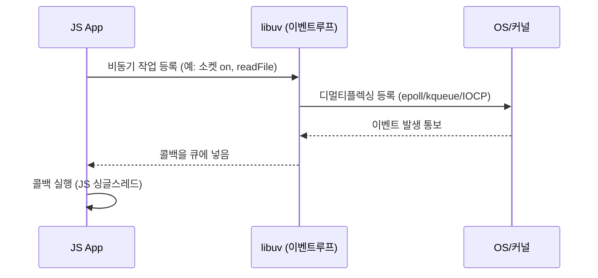

# Chapter 01. Node.js 플랫폼

## 1-1 Node.js 철학

- 경량 코어: 최소한의 기능을 가진 코어를 두고 외부 부분은 사용자 모듈 생태계애 맡김
- 경량 모듈: 작은 단위의 모듈로 기능을 제공, 패키지 관리자 (npm, yarn 등) 로 필요에 따라 조합 가능, 이해하기 쉽고 사용 용이
- 작은 외부 인터페이스: 최소한의 외부 노출
- 간결함과 실용주의

## 1-2. 작동 원리

### 이벤트 디멀티플렉싱

- 불로킹 I/O: 작업이 완료될 때까지 기다리지 않고 즉시 제어권 반환, 다른 작업 수행 가능, 각각의 스레드에서 처리
- 논블로킹 I/O: I/O 작업이 완료되었는지 확인하기 위해 지속적으로 상태를 확인 (polling), 단일 스레드에서 처리, CPU 자원 낭비 우려
- 논블로킹 I/O 와 유사하지만 polling 를 활용한 바쁜 대기 (Busy-waiting) 대신 동기 이벤트 디멀티플렉서 OR 이벤트 통지 인터페이스 매커니즘을 활용함
  - cf. 디멀티플렉싱: 하나의 입력 소스에서 여러 출력 대상으로 데이터를 분배하는 것
- 동기 이벤트 디멀티플렉서: 여러 개의 I/O 작업(파일, 네트워크 등)을 동시에 감시하다가, 그 중 어떤 것이 준비되었는지 알려주는 시스템
  - 예: epoll (Linux), kqueue (macOS), IOCP (Windows)
- 이벤트 디멀티플렉싱: 동기 이벤트 디멀티플렉서를 이용해서 단일 스레드에서 여러 I/O 작업을 효율적으로 처리하는 방법

### 리액터(Reactor) 패턴

- 비동기 I/O 작업을 처리하는 디자인 패턴
- 이벤트 소스에서 발생한 이벤트를 감지하고, 해당 이벤트에 대한 콜백 함수를 호출
- Node.js는 libuv 라이브러리를 사용하여 리액터 패턴을 구현

1. 이벤트 소스 (예: 네트워크 소켓, 파일 디스크립터)에서 이벤트가 발생
2. 이벤트 디멀티플렉서가 이벤트를 감지
3. 이벤트 루프가 이벤트 큐에서 대기 중인 이벤트를 확인
4. 해당 이벤트에 대한 콜백 함수를 호출하여 작업을 처리
5. 작업이 완료되면 결과를 반환하거나 후속 작업을 수행

#### Node.js 이벤트 루프 동작 원리

- 감지: 네트워크나 파일 같은 이벤트가 준비되었는지 커널(또는 libuv)이 본다.
- 분배: 준비된 이벤트를 이벤트 루프가 찾아서 어느 콜백에 넘길지 결정한다.
- 처리: 자바스크립트(싱글 스레드)가 콜백을 실행한다.

이벤트는 OS가 감지하고, libuv가 모아서 콜백을 큐에 넣고, JS가 그 콜백을 하나씩 실행한다.



상세 동작 흐름

1. JS에서 소켓이나 파일 읽기 같은 비동기 작업을 시작하고 콜백을 등록(Registration)
2. libuv가 OS에 "필요하면 알려줘"라고 등록하고 기다림(Poll)
3. OS가 "데이터 왔음!"이라고 알려주면 libuv가 해당 콜백을 실행 대기열에 넣음(Dispatch)
4. JS 엔진이 콜백을 꺼내 실행(Execution). 이때 JS는 다른 작업을 블로킹하지 않음
5. 다시 2~4를 반복(Loop)

### 구성 요소 매핑

- 디멀티플렉서: OS 레벨 (epoll/kqueue/IOCP) — 어떤 파일 디스크립터가 준비됐는지 감지
- 이벤트 루프: libuv — OS와 JS 런타임 사이에서 이벤트를 받아 스케줄링
- 핸들러/리액터: 사용자가 등록한 콜백(예: socket.on('data', ...), fs.readFile 콜백)
- 워커 스레드풀: 파일 I/O, DNS(비동기 구현), 암호화 등 블로킹 계열 작업은 libuv의 스레드풀에서 처리

[예시 코드](./code/event-loop-example.js) 참고.

#### 작업 우선순위

- process.nextTick: 현재 실행 중인 JS 콜백이 끝난 뒤 이벤트 루프의 다음 페이즈로 넘어가기 전에 즉시 실행되는 마이크로태스크(우선순위 높음)
- Promise .then / 마이크로태스크 큐: nextTick 다음, 일반 macrotask(setTimeout 등)보다 먼저 실행된다.
- setImmediate vs setTimeout(0): 이벤트 루프의 페이즈 차이 때문에 동작 순서가 예측과 다를 수 있음(환경에 따라)

### cf. Promise vs nextTick 선택 기준

**process.nextTick 사용:**

- 현재 작업 직후 즉시 실행해야 하는 경우
- 에러 처리나 이벤트 발생 전 초기화

```javascript
function asyncOperation(callback) {
  process.nextTick(() => {
    // 비동기처럼 보이게 만들기
    callback(null, "result");
  });
}
```

**Promise/마이크로태스크 사용:**

- 대부분의 비동기 작업
- async/await 사용
- 표준 JavaScript 패턴

```javascript
async function getData() {
  const result = await fetch("/api");
  return result.json();
}
```

### 정리: Node.js의 작동 원리

- 리액터 패턴: 이벤트 소스를 등록(등록자) → OS/루프(디멀티플렉서)가 어떤 이벤트가 준비됐는지 감지 → 등록된 핸들러(콜백)를 큐에 넣고 JS 스레드에서 실행
- Node.js에서는 이 전체 흐름을 libuv가 관리하고 JS 실행은 단일 스레드에서 이뤄짐

## Node.js 구성

- Node.js = V8 엔진 + libuv + C++ 바인딩 + Node.js API 구현하는 코어 JS 라이브러리

## 1-3. Node.js 에서 JavaScript

- 브라우저 JavaScript와 다름: DOM/BOM API 없음, window, document 객체 없음
- 모듈 시스템: CommonJS, ES 모듈 문법 지원
- 운영체제 기능 접근: fs, net, http 등 내장 모듈 제공, process 객체로 프로세스 정보 접근 가능
- 네이티브 코드 실행: N-API를 통해 C/C++ 으로 만든 네이티브 모듈 구현 가능
- JavaScript 엔진: V8 엔진 사용, 최신 JS 기능 지원, 웹어셈블리(Wasm) 지원

## 요약

- Node.js 철학 "Node way" : 작고 간단하며 최소한의 기능만을 노출
- Reactor 패턴: 이벤트 감지 → 콜백 큐에 분배 → JS 단일 스레드에서 실행
- 브라우저와 다르게 서버에서 동작하는 JavaScript 환경 제공

## 참고자료

- [Node.js 공식 문서 - 이벤트 루프](https://nodejs.org/en/docs/guides/event-loop-timers-and-nexttick/)
- [libuv 공식 문서](https://libuv.org/)
- [libuv 설명 글 by. Nikhil Marathe](https://nikhilm.github.io/uvbook/)
