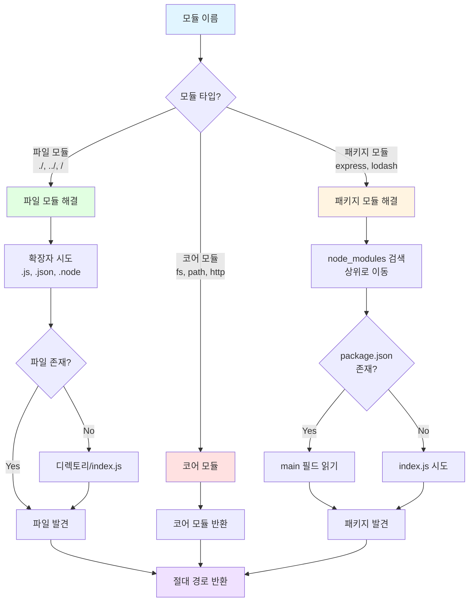
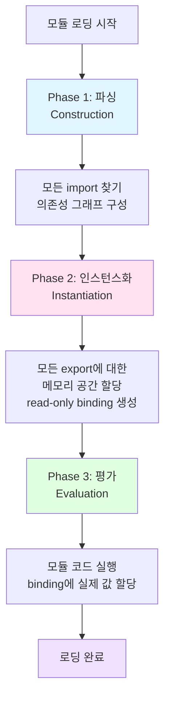

# Chapter 2: 모듈 시스템

> **발표자**: 길현준
> **주제**: CommonJS와 ESM, 그리고 모듈 패턴

---

## 개요

**왜 중요한가?**

모듈 시스템은 Node.js의 철학 중심에 있으며, 이 책의 모든 챕터가 여기서 다루는 지식에 의존할 만큼 중요합니다.

**학습 목표**:

- 모듈이 왜 필수적이며 Node.js에서 다른 모듈시스템이 가능한 이유 이해
- CommonJS 내부 동작 원리와 모듈 패턴 학습
- ES 모듈(ESM) 사용법과 특징 파악
- CommonJS와 ESM 사이의 차이점 및 상호 운용 방법 이해

---

### 핵심 키워드

- **모듈 시스템**: 코드 구조화, 재사용, 은닉성, 종속성 관리
- **CommonJS**: Node.js의 전통적 모듈 시스템, `require()`와 `module.exports`
- **ESM**: ECMAScript 표준 모듈, `import`와 `export`
- **모듈 패턴**: Named Exports, Substack Pattern, Singleton-like
- **상호 운용**: CommonJS와 ESM 간의 호환성

---

## 1. 모듈의 필요성

모듈은 주요 애플리케이션을 구조화하기 위한 부품입니다. 좋은 모듈 시스템은 소프트웨어 엔지니어링의 기본적인 필요성을 충족시킵니다.

### 1-1. 코드 분할

**목적**: 코드베이스를 여러 파일로 분할

```javascript
// ❌ 하나의 거대한 파일
// app.js (5000줄)
function getUserData() { /* ... */ }
function processPayment() { /* ... */ }
function sendEmail() { /* ... */ }
// ... 수천 줄의 코드

// ✅ 모듈로 분할
// user.js
export function getUserData() { /* ... */ }

// payment.js
export function processPayment() { /* ... */ }

// email.js
export function sendEmail() { /* ... */ }
```

**장점**:
- 구조적 코드 관리
- 독립적인 기능 개발 및 테스트
- 이해하기 쉬운 코드베이스

---

### 1-2. 재사용성

**목적**: 다른 프로젝트에 코드 재사용

```javascript
// utils/logger.js - 여러 프로젝트에서 사용 가능
export function log(message) {
  console.log(`[${new Date().toISOString()}] ${message}`)
}

// Project A에서 사용
import { log } from './utils/logger.js'

// Project B에서도 동일하게 사용
import { log } from './utils/logger.js'
```

---

### 1-3. 은닉성 (Information Hiding)

**목적**: 복잡한 구현을 숨기고 명료한 인터페이스만 노출

```javascript
// logger.js
let count = 0  // 비공개 변수

export function log(message) {  // 공개 인터페이스
  count++
  console.log(`[${count}] ${message}`)
}

// count 변수는 외부에서 접근 불가
// log 함수만 사용 가능
```

**원칙**:
- 공개 인터페이스는 간단하고 명확하게
- 내부 구현 세부사항은 숨김
- 변경에 대한 영향 범위 최소화

---

### 1-4. 종속성 관리

**목적**: 서드파티를 포함한 모듈 간 의존성 관리

```javascript
// app.js
import express from 'express'  // 서드파티 모듈
import { log } from './logger.js'  // 로컬 모듈

// 필요한 모든 종속성을 명시적으로 선언
```

**장점**:
- 명시적인 의존성 선언
- 자동 종속성 해결
- 버전 관리 용이

---

## 2. JavaScript와 Node.js에서의 모듈 시스템

### 2-1. 역사적 배경

**초기 JavaScript** (2000년대 초반):
```html
<!-- 모듈 시스템 없이 script 태그로 로드 -->
<script src="jquery.js"></script>
<script src="app.js"></script>
<!-- 순서가 중요하고, 전역 네임스페이스 오염 문제 -->
```

**AMD (Asynchronous Module Definition)**:
- RequireJS에 의해 대중화
- 브라우저 환경의 비동기 로딩 지원

**UMD (Universal Module Definition)**:
- AMD와 CommonJS를 모두 지원하는 범용 패턴

---

### 2-2. CommonJS의 등장 (2009)

**배경**:
- Node.js는 서버 런타임으로 파일시스템 직접 접근 가능
- HTML `<script>`나 URL에 의존하지 않음
- 로컬 파일시스템의 JavaScript 파일만 사용

**특징**:
```javascript
// CommonJS 방식
const fs = require('fs')  // 동기적 로딩
const myModule = require('./myModule')

module.exports = { /* ... */ }
```

**영향**:
- Node.js의 주된 모듈 시스템
- Browserify, Webpack 등 번들러를 통해 브라우저에서도 사용

---

### 2-3. ESM의 등장 (2015)

**ECMAScript 2015 (ES6)**:
- JavaScript 표준 모듈 시스템 제안
- 문법과 의미론 정의

**특징**:
```javascript
// ESM 방식
import fs from 'fs'  // 정적 분석 가능
import { myFunction } from './myModule.js'

export function myFunction() { /* ... */ }
```

**Node.js 지원**:
- Node.js 13.2부터 안정적 지원
- 브라우저와 서버 환경 통합

**현재 상황**:
- ESM이 표준이 되어가는 중
- 대부분 프로젝트는 여전히 CommonJS 의존
- 점진적 마이그레이션 진행 중

---

## 3. 모듈 시스템과 패턴

### 3-1. 노출식 모듈 패턴 (Revealing Module Pattern)

**목적**: 모듈 시스템 없이도 은닉성과 네임스페이스 제공

**IIFE (Immediately Invoked Function Expression)**:

```javascript
const myModule = (() => {
  // 비공개 변수와 함수
  const privateFoo = () => {
    console.log('This is private')
  }
  const privateBar = []

  // 공개 인터페이스
  const exported = {
    publicFoo: () => {
      privateFoo()
      console.log('This is public')
    },
    publicBar: () => {
      privateBar.push('value')
      return privateBar
    }
  }

  return exported  // 공개할 것만 반환
})()  // 즉시 실행

// 사용
myModule.publicFoo()  // ✅ 가능
myModule.privateFoo()  // ❌ 접근 불가
```

**동작 원리**:
1. 함수를 정의하고 즉시 실행
2. 함수 내부는 독립적인 스코프 형성
3. 반환된 객체만 외부에 노출

**장점**:
- 전역 네임스페이스 오염 방지
- 진정한 비공개 변수 구현
- 모듈 시스템 없이도 사용 가능

**역사적 의의**:
- CommonJS 이전 JavaScript의 모듈 패턴
- 현재는 ES6 모듈로 대체됨

---

## 4. CommonJS 모듈

### 4-1. 직접 만드는 모듈 로더

**목적**: `require()`의 내부 동작 이해

**loadModule 함수**:

```javascript
function loadModule(filename, module, require) {
  const wrappedSrc = `(function(module, exports, require) {
    ${fs.readFileSync(filename, 'utf8')}
  })(module, module.exports, require)`

  eval(wrappedSrc)
}
```

**래핑 원리**:
```javascript
// 원본 모듈 코드
exports.hello = 'world'

// Node.js가 실제로 실행하는 코드
(function(module, exports, require) {
  exports.hello = 'world'
})(module, module.exports, require)
```

**require() 함수 구현**:

```javascript
function require(moduleName) {
  console.log(`Require invoked for module: ${moduleName}`)

  const id = require.resolve(moduleName)  // 1. 경로 해결

  if (require.cache[id]) {  // 2. 캐시 확인
    return require.cache[id].exports
  }

  const module = {  // 3. 모듈 메타데이터 생성
    exports: {},
    id
  }

  require.cache[id] = module  // 4. 캐시에 추가

  loadModule(id, module, require)  // 5. 모듈 로드

  return module.exports  // 6. exports 반환
}

require.cache = {}
require.resolve = (moduleName) => {
  /* 모듈 이름으로 전체 경로 찾기 */
}
```

**핵심 단계**:
1. **해결(Resolve)**: 모듈 이름 → 전체 경로
2. **캐시 확인**: 이미 로드되었는지 확인
3. **메타데이터 생성**: `module` 객체 생성
4. **캐싱**: 순환 종속성 방지
5. **로드**: 모듈 코드 실행
6. **반환**: `module.exports` 반환

---

### 4-2. module.exports vs exports

**핵심 차이점**:

```javascript
// logger.js

// ✅ 방법 1: exports에 속성 추가
exports.info = (message) => {
  console.log(`info: ${message}`)
}

// ✅ 방법 2: module.exports 재할당
module.exports = (message) => {
  console.log(message)
}

// ❌ 틀린 방법: exports 재할당
exports = (message) => {  // 동작하지 않음!
  console.log(message)
}
```

**왜 exports 재할당은 안되는가?**

```javascript
// require() 내부 동작
function require(moduleName) {
  const module = {
    exports: {}
  }

  // 초기 상태: exports는 module.exports의 참조
  let exports = module.exports

  // 모듈 코드 실행
  (function(module, exports, require) {
    // exports = ... 하면 참조가 끊김
    // module.exports는 여전히 원래 객체
  })(module, exports, require)

  return module.exports  // exports가 아닌 module.exports 반환
}
```

**올바른 사용 패턴**:

```javascript
// 패턴 1: exports에 속성 추가 (Named Exports)
exports.a = 1
exports.b = 2

// 패턴 2: module.exports 재할당 (Single Export)
module.exports = function() { /* ... */ }
module.exports = class MyClass { /* ... */ }
```

---

### 4-3. require 함수는 동기적이다

**동기적 특성**:

```javascript
// 순차적 실행
const a = require('./a')  // a 로드 완료까지 대기
const b = require('./b')  // b 로드 완료까지 대기
const c = require('./c')  // c 로드 완료까지 대기

console.log('All modules loaded')  // 모든 로드 완료 후 실행
```

**왜 동기적인가?**
- Node.js는 파일시스템 접근 가능
- 로컬 파일 읽기는 충분히 빠름
- 간단하고 직관적인 API

**조건부 로딩**:

```javascript
// 런타임 조건에 따라 로딩
if (condition) {
  const moduleA = require('./moduleA')
} else {
  const moduleB = require('./moduleB')
}
```

**주의사항**:
```javascript
// ❌ 비동기 함수 내에서 require는 피하기
async function loadModule() {
  const module = require('./module')  // 동기 호출
  // 이벤트 루프 블로킹 가능
}

// ✅ 대신 동적 import 사용 (ESM)
async function loadModule() {
  const module = await import('./module.mjs')
}
```

---

### 4-4. 해결(Resolving) 알고리즘

**목적**: 모듈 이름을 절대 경로로 변환



**파일 모듈** (`./`, `../`, `/`):

```javascript
require('./logger')
// 해결 순서:
// 1. /current/path/logger.js
// 2. /current/path/logger.json
// 3. /current/path/logger.node
// 4. /current/path/logger/package.json (main 필드)
// 5. /current/path/logger/index.js
```

**코어 모듈** (`fs`, `path`, `http`):

```javascript
require('fs')
// Node.js 내장 모듈
// 다른 모듈보다 우선순위 높음
```

**패키지 모듈** (`express`, `lodash`):

```javascript
require('express')
// 해결 순서 (현재 디렉토리가 /home/user/project/lib라면):
// 1. /home/user/project/lib/node_modules/express
// 2. /home/user/project/node_modules/express
// 3. /home/user/node_modules/express
// 4. /home/node_modules/express
// 5. /node_modules/express
```

**패키지 구조**:

```
node_modules/
└── express/
    ├── package.json  ← "main": "index.js"
    ├── index.js
    └── lib/
        └── application.js
```

---

### 4-5. 모듈 캐싱

**목적**: 동일 모듈을 여러 번 로드하지 않음

**캐싱 메커니즘**:

```javascript
// 첫 번째 require: 모듈 로드 및 캐싱
const moduleA1 = require('./moduleA')

// 두 번째 require: 캐시에서 반환
const moduleA2 = require('./moduleA')

console.log(moduleA1 === moduleA2)  // true (같은 객체)
```

**캐시 확인**:

```javascript
console.log(require.cache)
// {
//   '/path/to/moduleA.js': {
//     id: '/path/to/moduleA.js',
//     exports: { /* ... */ },
//     loaded: true,
//     // ...
//   }
// }
```

**캐시 무효화**:

```javascript
// 캐시 삭제
delete require.cache[require.resolve('./moduleA')]

// 다시 로드 (새 인스턴스 생성)
const moduleA = require('./moduleA')
```

**Singleton 패턴과의 관계**:

```javascript
// logger.js
class Logger {
  constructor() {
    this.count = 0
  }
  log(message) {
    this.count++
    console.log(`[${this.count}] ${message}`)
  }
}

module.exports = new Logger()  // 인스턴스 내보내기

// main.js
const logger1 = require('./logger')
const logger2 = require('./logger')

logger1.log('Hello')  // [1] Hello
logger2.log('World')  // [2] World (같은 인스턴스!)
```

**주의사항**:
- 캐시 키는 **절대 경로**
- 심볼릭 링크는 다른 캐시 키 생성
- 대소문자 구분 (Windows 제외)

---

### 4-6. 순환 종속성 (Circular Dependencies)

**문제 상황**:

```javascript
// a.js
exports.loaded = false
const b = require('./b')
module.exports = {
  b,
  loaded: true
}

// b.js
exports.loaded = false
const a = require('./a')
module.exports = {
  a,
  loaded: true
}

// main.js
const a = require('./a')
console.log('a.loaded:', a.loaded)  // true
console.log('a.b.loaded:', a.b.loaded)  // true
console.log('a.b.a.loaded:', a.b.a.loaded)  // false (!?)
```

**왜 `a.b.a.loaded`가 false인가?**

**실행 순서**:

1. `main.js`가 `a.js` require
2. `a.js` 시작: `exports.loaded = false`
3. `a.js`가 `b.js` require
4. `b.js` 시작: `exports.loaded = false`
5. `b.js`가 `a.js` require
6. **`a.js`는 이미 캐시에 있음** → 현재 `exports` 반환 (`{loaded: false}`)
7. `b.js` 완료: `{a: {loaded: false}, loaded: true}`
8. `a.js` 완료: `{b: {a: {loaded: false}, loaded: true}, loaded: true}`

**핵심 원리**:
- 순환 종속성 감지 시 **불완전한 exports 반환**
- 캐싱 덕분에 무한 루프 방지

**해결 방법**:

```javascript
// ✅ 방법 1: 순환 종속성 피하기 (권장)
// 공통 부분을 별도 모듈로 분리

// ✅ 방법 2: exports 대신 module.exports 사용
// exports = {...}는 순환에서 문제 발생 가능

// ✅ 방법 3: 지연 로딩 (함수 내에서 require)
function getB() {
  return require('./b')
}
```

---

## 5. 모듈 정의 패턴

### 5-1. exports 지정하기 (Named Exports)

**패턴**: 여러 함수/클래스를 exports에 추가

```javascript
// logger.js
exports.info = (message) => {
  console.log(`info: ${message}`)
}

exports.verbose = (message) => {
  console.log(`verbose: ${message}`)
}

exports.error = (message) => {
  console.error(`error: ${message}`)
}

// main.js
const logger = require('./logger')
logger.info('Hello')
logger.verbose('Details')

// 또는 구조 분해
const { info, error } = require('./logger')
info('Hello')
error('Oops!')
```

**장점**:
- 명확한 API
- 트리 쉐이킹 가능 (번들러)
- 네임스페이스 제공

**사용 예**: Node.js 코어 모듈 (`fs`, `path`, `util`)

---

### 5-2. 함수 내보내기 (Substack Pattern)

**패턴**: 단일 함수를 주 기능으로, 부가 기능은 속성으로

```javascript
// logger.js
module.exports = (message) => {
  console.log(`info: ${message}`)
}

module.exports.verbose = (message) => {
  console.log(`verbose: ${message}`)
}

module.exports.error = (message) => {
  console.error(`error: ${message}`)
}

// main.js
const logger = require('./logger')

logger('Hello')  // 기본 함수 호출
logger.verbose('Details')  // 부가 기능 호출
logger.error('Oops!')
```

**명명**: James Halliday (@substack)가 대중화

**장점**:
- 명확한 주 진입점
- 최소 외부 인터페이스 (Small Surface Area)
- 단일 책임 원칙 (SRP) 준수

**사용 예**: `express()`, `debug()`, `request()`

---

### 5-3. 클래스 내보내기

**패턴**: 클래스를 export하여 사용자가 인스턴스 생성

```javascript
// Logger.js
class Logger {
  constructor(name) {
    this.name = name
  }

  log(message) {
    console.log(`[${this.name}] ${message}`)
  }

  info(message) {
    this.log(`INFO: ${message}`)
  }

  debug(message) {
    this.log(`DEBUG: ${message}`)
  }
}

module.exports = Logger

// main.js
const Logger = require('./Logger')

const dbLogger = new Logger('DB')
const apiLogger = new Logger('API')

dbLogger.info('Connected')  // [DB] INFO: Connected
apiLogger.info('Request received')  // [API] INFO: Request received
```

**장점**:
- 프로토타입 확장 가능
- 여러 인스턴스 생성 가능
- 상속 구조 구현 가능

**단점**:
- 내부 구현 노출 (캡슐화 약화)
- 확장을 통한 악용 가능성

---

### 5-4. 인스턴스 내보내기 (Singleton-like)

**패턴**: 인스턴스를 export (모듈 캐싱 활용)

```javascript
// logger.js
class Logger {
  constructor(name) {
    this.count = 0
    this.name = name
  }

  log(message) {
    this.count++
    console.log(`[${this.count}] [${this.name}] ${message}`)
  }
}

module.exports = new Logger('DEFAULT')

// main1.js
const logger = require('./logger')
logger.log('Hello from main1')  // [1] [DEFAULT] Hello from main1

// main2.js
const logger = require('./logger')
logger.log('Hello from main2')  // [2] [DEFAULT] Hello from main2
```

**장점**:
- 상태 공유
- 캐싱을 통한 단일 인스턴스 보장

**주의사항**:
```javascript
// 완벽한 싱글톤은 아님!
// 서로 다른 경로로 require하면 다른 인스턴스
const logger1 = require('./logger')
const logger2 = require('../somewhere/logger')  // 다른 인스턴스 가능
```

**사용 예**: 데이터베이스 연결, 설정 객체

---

### 5-5. 몽키 패칭 (Monkey Patching)

**개념**: 런타임에 기존 모듈 수정

```javascript
// patcher.js
require('./logger').customMessage = function() {
  console.log('This is a new functionality')
}

// main.js
const logger = require('./logger')
require('./patcher')  // 패치 적용

logger.customMessage()  // 'This is a new functionality'
```

**위험성**:

```javascript
// ❌ 나쁜 예: 글로벌 객체 수정
require('./patcher')  // Array.prototype을 수정

// 다른 모듈에 예상치 못한 영향
const arr = [1, 2, 3]
arr.someNewMethod()  // 어디서 온 메서드?
```

**사용 용도**:
- 테스트 목적 (모킹)
- 임시 버그 수정
- 폴리필

**권장 사항**:
- 가능한 피하기
- 테스트 환경에서만 사용
- 대안: Jest mocking, Proxyquire, Sinon

---

## 6. ESM (ECMAScript Modules)

### 6-1. Node.js에서 ESM 사용

**방법 1: .mjs 확장자**

```javascript
// logger.mjs
export function log(message) {
  console.log(message)
}

// main.mjs
import { log } from './logger.mjs'
log('Hello ESM!')
```

**방법 2: package.json 설정**

```json
{
  "type": "module"
}
```

```javascript
// logger.js (이제 ESM으로 처리됨)
export function log(message) {
  console.log(message)
}

// main.js
import { log } from './logger.js'
log('Hello ESM!')
```

**CommonJS 사용하려면**:

```json
{
  "type": "module"
}
```

```javascript
// common.cjs (CommonJS 강제)
module.exports = { /* ... */ }
```

---

### 6-2. exports와 imports 지정하기

**Named Exports**:

```javascript
// logger.mjs
export function log(message) {
  console.log(message)
}

export const DEFAULT_LEVEL = 'info'

export class Logger {
  constructor(name) {
    this.name = name
  }
}

// main.mjs
import { log, DEFAULT_LEVEL, Logger } from './logger.mjs'

log('Hello')
console.log(DEFAULT_LEVEL)
const logger = new Logger('APP')
```

**여러 가지 import 방법**:

```javascript
// 전체 import
import * as loggerModule from './logger.mjs'
loggerModule.log('Hello')

// 구조 분해 import
import { log, Logger } from './logger.mjs'

// 별칭 사용
import { log as writeLog } from './logger.mjs'
writeLog('Hello')
```

---

### 6-3. export와 import 기본값 설정하기

**Default Export**:

```javascript
// logger.mjs
export default class Logger {
  constructor(name) {
    this.name = name
  }

  log(message) {
    console.log(`[${this.name}] ${message}`)
  }
}

// main.mjs
import Logger from './logger.mjs'  // 중괄호 없음
const logger = new Logger('APP')
logger.log('Hello')

// 또는 다른 이름 사용
import MyLogger from './logger.mjs'
const log = new MyLogger('APP')
```

**혼합 Exports**:

```javascript
// logger.mjs
export default function log(message) {
  console.log(message)
}

export function info(message) {
  log(`info: ${message}`)
}

export function error(message) {
  log(`error: ${message}`)
}

// main.mjs
import log, { info, error } from './logger.mjs'

log('Hello')
info('Information')
error('Error occurred')
```

---

### 6-4. 비동기 임포트 (Dynamic Imports)

**문법**:

```javascript
// 동적 import는 Promise 반환
const module = await import('./module.mjs')
```

**다국어 지원 예제**:

```javascript
// strings-en.mjs
export const HELLO = 'Hello'
export const GOODBYE = 'Goodbye'

// strings-ko.mjs
export const HELLO = '안녕하세요'
export const GOODBYE = '안녕히 가세요'

// main.mjs
const SUPPORTED_LANGUAGES = ['en', 'ko']
const selectedLanguage = process.argv[2]

if (!SUPPORTED_LANGUAGES.includes(selectedLanguage)) {
  console.error('The specified language is not supported')
  process.exit(1)
}

const translationModule = `./strings-${selectedLanguage}.mjs`
const strings = await import(translationModule)

console.log(strings.HELLO)
console.log(strings.GOODBYE)
```

**실행**:

```bash
node main.mjs en
# Hello
# Goodbye

node main.mjs ko
# 안녕하세요
# 안녕히 가세요
```

**장점**:
- 조건부 모듈 로딩
- 지연 로딩 (Lazy Loading)
- 코드 분할 (Code Splitting)

---

### 6-5. 모듈 적재 이해하기 (3단계 로딩)

**ESM 로딩 프로세스**:



**Phase 1: 파싱 (Parsing)**

```javascript
// main.mjs
import { a } from './moduleA.mjs'
import { b } from './moduleB.mjs'

console.log(a, b)
```

- 모든 `import` 문 정적 분석
- 의존성 그래프 구성
- 모든 파일 다운로드/읽기

**Phase 2: 인스턴스화 (Instantiation)**

```javascript
// moduleA.mjs
export let a = 1

// moduleB.mjs
export let b = 2
```

- Export에 대한 메모리 공간 할당
- **Read-only live bindings** 생성
- 아직 코드 실행 안 함

**Phase 3: 평가 (Evaluation)**

```javascript
// 이제 코드 실행
// 할당된 메모리에 실제 값 쓰기
```

**왜 3단계인가?**

- **정적 분석 가능**: 번들러가 트리 쉐이킹 수행
- **순환 종속성 처리**: CommonJS보다 우수
- **효율적 캐싱**: 각 단계별로 캐싱 가능

---

### 6-6. Read-only Live Bindings

**핵심 개념**: ESM의 export는 값의 복사가 아닌 **참조**

```javascript
// counter.mjs
export let count = 0

export function increment() {
  count++
}

// main.mjs
import { count, increment } from './counter.mjs'

console.log(count)  // 0
increment()
console.log(count)  // 1 (변경 반영!)

// count++  // ❌ TypeError: Assignment to constant variable!
// count는 읽기 전용!
```

**CommonJS와의 차이**:

```javascript
// CommonJS (값의 복사)
// counter.js
let count = 0
exports.count = count
exports.increment = () => {
  count++
  exports.count = count  // 명시적 업데이트 필요
}

// main.js
const counter = require('./counter')
console.log(counter.count)  // 0
counter.increment()
console.log(counter.count)  // 여전히 0 (복사본이므로)
```

**장점**:
- 모듈 간 상태 동기화
- 더 예측 가능한 동작
- 순환 종속성 문제 완화

---

### 6-7. 순환 종속성 (ESM)

**ESM의 순환 종속성 처리**:

```javascript
// a.mjs
import * as bModule from './b.mjs'
export let loaded = false
export const b = bModule
loaded = true

// b.mjs
import * as aModule from './a.mjs'
export let loaded = false
export const a = aModule
loaded = true

// main.mjs
import * as a from './a.mjs'

console.log('a.loaded:', a.loaded)  // true
console.log('a.b.loaded:', a.b.loaded)  // true
console.log('a.b.a.loaded:', a.b.a.loaded)  // true (!)
```

**왜 잘 동작하는가?**

1. **Phase 1**: 모든 모듈 파싱, 의존성 그래프 구성
2. **Phase 2**: 모든 export에 대한 binding 생성
3. **Phase 3**: 코드 실행 (모든 binding이 이미 존재)

**CommonJS vs ESM**:

| 특징 | CommonJS | ESM |
|------|----------|-----|
| 로딩 | 동기적, 순차적 | 비동기적, 병렬 |
| 순환 처리 | 불완전한 exports | Live bindings |
| 결과 | 일부 undefined | 모두 정상 동작 |

---

## 7. ESM과 CommonJS 차이점

### 7-1. 주요 차이점 비교

| 특징 | CommonJS | ESM |
|------|----------|-----|
| **문법** | `require()`, `module.exports` | `import`, `export` |
| **로딩** | 동기적 (Synchronous) | 비동기적 (Asynchronous) |
| **시점** | 런타임 (Runtime) | 파싱 시점 (Parse-time) |
| **동적 여부** | 동적 (Dynamic) | 정적 (Static) |
| **캐싱** | 값의 복사 (Copy) | Live bindings (Reference) |
| **조건부 로딩** | ✅ 가능 | ❌ 불가 (동적 import 필요) |
| **트리 쉐이킹** | ❌ 어려움 | ✅ 가능 |
| **순환 종속성** | 불완전한 exports | Live bindings로 해결 |
| **strict 모드** | 선택적 | 항상 적용 |

---

### 7-2. 문법 비교

**CommonJS**:

```javascript
// 가져오기
const fs = require('fs')
const { join } = require('path')
const myModule = require('./myModule')

// 내보내기
module.exports = function() { /* ... */ }
module.exports = { a: 1, b: 2 }
exports.myFunction = () => { /* ... */ }
```

**ESM**:

```javascript
// 가져오기
import fs from 'fs'
import { join } from 'path'
import myModule from './myModule.mjs'

// 내보내기
export default function() { /* ... */ }
export const a = 1, b = 2
export function myFunction() { /* ... */ }
```

---

### 7-3. 조건부 로딩

**CommonJS (가능)**:

```javascript
let module
if (condition) {
  module = require('./moduleA')
} else {
  module = require('./moduleB')
}
```

**ESM (불가 - 대신 동적 import)**:

```javascript
// ❌ 정적 import는 조건문 안에 사용 불가
if (condition) {
  import moduleA from './moduleA.mjs'  // SyntaxError!
}

// ✅ 동적 import 사용
let module
if (condition) {
  module = await import('./moduleA.mjs')
} else {
  module = await import('./moduleB.mjs')
}
```

---

### 7-4. ESM에서의 참조 유실

**문제**: ESM에는 `__filename`, `__dirname`, `require` 없음

**해결책**:

```javascript
// reconstruct.mjs
import { fileURLToPath } from 'url'
import { dirname } from 'path'
import { createRequire } from 'module'

// __filename 재구성
const __filename = fileURLToPath(import.meta.url)

// __dirname 재구성
const __dirname = dirname(__filename)

// require 재구성
const require = createRequire(import.meta.url)

// 사용
console.log(__filename)  // /path/to/reconstruct.mjs
console.log(__dirname)   // /path/to
const fs = require('fs')  // CommonJS 모듈 사용 가능
```

**import.meta.url**:

```javascript
console.log(import.meta.url)
// file:///Users/user/project/module.mjs
```

---

### 7-5. 상호 운용 (Interoperability)

**ESM → CommonJS (가능)**:

```javascript
// logger.js (CommonJS)
module.exports = {
  log: (message) => console.log(message)
}

// main.mjs (ESM)
import logger from './logger.js'
logger.log('Hello from ESM!')  // ✅ 동작

// 또는
import { createRequire } from 'module'
const require = createRequire(import.meta.url)
const logger = require('./logger.js')
```

**CommonJS → ESM (제한적)**:

```javascript
// logger.mjs (ESM)
export function log(message) {
  console.log(message)
}

// main.js (CommonJS)
const logger = require('./logger.mjs')  // ❌ Error!

// ✅ 동적 import 사용 (async 필요)
(async () => {
  const logger = await import('./logger.mjs')
  logger.log('Hello')
})()
```

**Best Practice**:

1. **신규 프로젝트**: ESM 사용
2. **기존 프로젝트**: 점진적 마이그레이션
3. **라이브러리**: Dual package (CommonJS + ESM 모두 제공)

---

## 8. 실습 코드

이 장의 핵심 개념을 실습할 수 있는 코드 예제를 제공합니다.

### 8-1. 코드 예제 목록

```
code/
├── 01-revealing-module-pattern.js
├── 02-commonjs-named-exports/
├── 03-commonjs-substack-pattern/
├── 04-commonjs-circular-deps/
├── 05-esm-named-exports/
├── 06-esm-default-exports/
├── 07-esm-dynamic-imports/
├── 08-esm-live-bindings/
├── package.json
└── README.md
```

### 8-2. 주요 학습 포인트

**CommonJS 예제**:
1. Revealing Module Pattern - IIFE 활용
2. Named Exports - 여러 함수 export
3. Substack Pattern - 단일 함수 + 부가 기능
4. 순환 종속성 - 불완전한 exports 체험

**ESM 예제**:
5. Named Exports - `export function`
6. Default Exports - `export default`
7. Dynamic Imports - `await import()`
8. Live Bindings - 참조 특성 체험

자세한 실행 방법은 `code/README.md`를 참고하세요.

---

## 9. 참고 자료

### 공식 문서

- **Node.js Modules**: https://nodejs.org/api/modules.html
- **Node.js ECMAScript Modules**: https://nodejs.org/api/esm.html
- **MDN Import**: https://developer.mozilla.org/en-US/docs/Web/JavaScript/Reference/Statements/import
- **MDN Export**: https://developer.mozilla.org/en-US/docs/Web/JavaScript/Reference/Statements/export

### 추가 학습 자료

- **CommonJS Spec**: http://www.commonjs.org/specs/modules/1.0/
- **ECMAScript Modules**: https://tc39.es/ecma262/#sec-modules
- **Node.js ES Modules**: https://nodejs.org/dist/latest-v18.x/docs/api/esm.html

### 도구

- **Browserify**: http://browserify.org/
- **Webpack**: https://webpack.js.org/
- **Rollup**: https://rollupjs.org/

---

## 요약

**모듈의 4가지 필요성**:
1. 코드 분할
2. 재사용성
3. 은닉성
4. 종속성 관리

**CommonJS 핵심**:
- `require()`는 동기적
- `module.exports` vs `exports`
- 모듈 해결 알고리즘
- 캐싱 메커니즘
- 순환 종속성 처리

**ESM 핵심**:
- 정적 분석 가능
- 3단계 로딩 (파싱, 인스턴스화, 평가)
- Read-only live bindings
- 우수한 순환 종속성 처리
- 동적 import 지원

**마이그레이션 방향**:
- CommonJS → ESM
- 신규 프로젝트는 ESM 권장
- 점진적 전환 전략 수립

---

**다음 챕터 예고**: Chapter 3에서는 콜백과 이벤트를 활용한 비동기 프로그래밍 패턴을 학습합니다.
