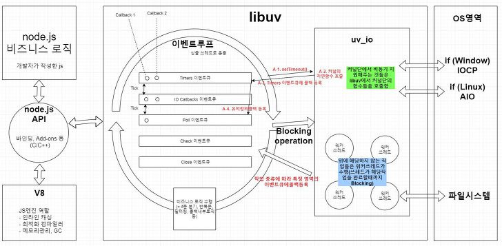

## 예제 코드

```jsx
console.log("start");

setTimeout(() => console.log("setTimeout"), 0);
setImmediate(() => console.log("setImmediate"));
process.nextTick(() => console.log("nextTick"));
Promise.resolve().then(() => console.log("promise"));

console.log("end");
```

<aside>
1️⃣

왜 nextTick, promise가 setTimeout, setImmediate보다 먼저 실행될까?

</aside>

## Event Loop?

Node.js는 싱글 스레드지만 비동기 처리를 이벤트 루프(Event Loop)로 관리한다.

이벤트 루프는 여러 단계를 돌면서, 각 단계마다 완료된 비동기 작업의 콜백을 실행하는 구조다.

이벤트 루프는 아래와 같은 6단계로 진행된다.

 https://sjh836.tistory.com/149

1. timers: setTimeout, setInterval
2. pending callbacks: 일부 시스템 콜백
3. idle, prepare: 내부 준비단계
4. poll: I/O 관련 콜백
5. check: setImmediate 같은 즉시 실행 예약된 콜백 실행
6. close callbacks: close 이벤트 처리

## NodeJS의 작업 큐

각 단계로 이동할 때 Node는 세 가지 작업 큐를 관리한다.

| **큐 이름**         | **실행 시점**                                                                            |
| ------------------- | ---------------------------------------------------------------------------------------- |
| main (call stack)   | 즉시 실행                                                                                |
| **nextTick queue**  | nextTick 큐는 **현재 콜스택이 비자마자 실행된다.** microtask(Promise)보다 먼저 실행된다. |
| **microtask queue** | 현재 단계 끝난 직후, 다음 단계 가기 전에 (매 단계가 끝날 때마다 먼저 처리된다.)          |
| **macrotask queue** | 다음 이벤트 루프 사이클에서                                                              |

1. 현재 콜스택의 동기 코드 실행

   → console.log("start"), console.log("end")

2. process.**nextTick** 큐 처리

   → 항상 다음 단계 전에 실행

3. **microtask** 큐 처리 (Promise.then, queueMicrotask)

   → nextTick 다음

4. **macrotask** 큐 처리
   - timers phase (setTimeout, setInterval)
   - poll → check (setImmediate)

**→ 이벤트 루프의 한 단계가 끝날 때마다 Node는 먼저 nextTick, microtask 를 모두 비우고,**

**다음 단계(macrotask)로 이동한다.**

<aside>
2️⃣

왜 `setTimeout(..., 0)`과 `setImmediate()`의 실행 순서가 가끔 바뀔까?

</aside>

## 왜 순서가 바뀔까?

이벤트 루프는 아래와 같은 순서로 진행된다.

```jsx
timers → pending → poll → check → close
```

→ `setTimeout`은 timers 단계

→ `setImmediate`은 check 단계

에서 실행된다.

poll에서 얼마나 있냐에 따라, 실행 순서가 달라질 수 있다.

1. poll이 비어있는 경우,
   1. 실행되어야 할 timer가 있는 경우 timers로 바로 이동한다.
   2. 실행되어야 할 timer가 없는 경우 check로 이동한다.
2. poll이 차 있는 경우, 먼저 I/O 콜백 처리 후 check로 이동한다.

## 처음의 예제

```jsx
setTimeout(() => console.log("timeout"), 0);
setImmediate(() => console.log("immediate"));
```

- `setTimeout(..., 0)`도 실제로는 **최소 1ms 정도의 지연시간**이 존재한다.
- OS 스케줄러 타이밍, stdout flush 같은 미세한 I/O로 인해 **poll이 아주 짧게 대기할 수도 있다.**
- 그럼 poll이 끝난 뒤 실행할 timer가 없고, check phase로 먼저 이동
  → `setImmediate`가 먼저 실행된다.

## 명시적 I/O가 있을 때 (poll이 차 있는 경우)

```jsx
const fs = require("fs");

fs.readFile(__filename, () => {
  setTimeout(() => console.log("timeout"), 0);
  setImmediate(() => console.log("immediate"));
});
```

- 출력 결과는 항상 아래 상태와 같다.

```jsx
immediate;
timeout;
```

- 왜냐하면,
  - `readFile` 콜백은 **poll phase**에서 실행
  - poll이 끝나자마자 check phase로 이동 → `setImmediate` 실행
  - 그다음 루프의 timers phase에서 `setTimeout` 실행

## 결론

- nextTick, promise가 setTimeout, setImmediate보다 먼저 실행된다.
- setTimeout, setImmediate은 poll에서 얼마나 있냐에 따라 실행 순서가 달라질 수 있다.

```jsx
console.log("start"); // 1

setTimeout(() => console.log("setTimeout"), 0); // 5 or 6
setImmediate(() => console.log("setImmediate")); // 5 or 6
process.nextTick(() => console.log("nextTick")); // 3
Promise.resolve().then(() => console.log("promise")); // 4

console.log("end"); // 2
```

```jsx
// 결과
start;
end;
nextTick;
promise;
setTimeout;
setImmediate;
```

---
