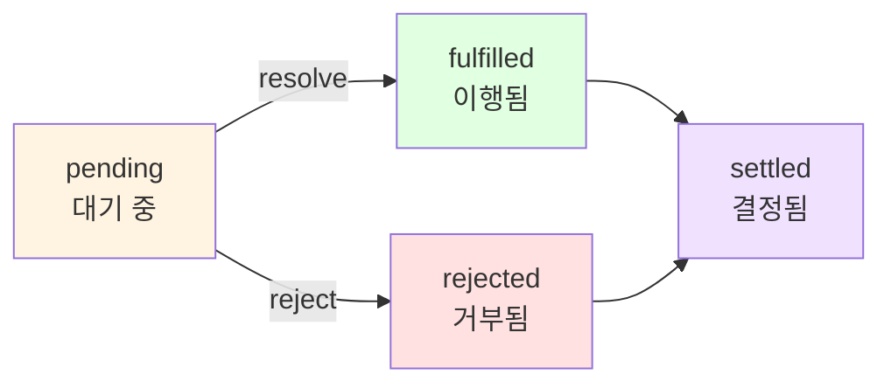

# Chapter 5: Promise 그리고 Async/Await와 함께 하는 비동기 제어 흐름 패턴

> **발표자**: 길현준
> **발표일**: 2024-11-10
> **주제**: 프라미스와 Async/Await를 활용한 비동기 프로그래밍

---

## 📌 목차

1. [개요](#개요)
2. [프라미스(Promise) 기초](#1-프라미스promise-기초)
3. [프라미스 활용 패턴](#2-프라미스-활용-패턴)
4. [Async/Await](#3-asyncawait)
5. [고급 주제](#4-고급-주제)
6. [핵심 요약](#핵심-요약)
7. [실습 코드](#실습-코드)
8. [참고 자료](#참고-자료)

---

## 개요

### 왜 이 챕터가 중요한가?

Chapter 4에서 콜백 기반 비동기 프로그래밍의 기초를 배웠다면, Chapter 5는 **현대적인 JavaScript 비동기 프로그래밍의 핵심**을 다룹니다. 프라미스와 async/await는 콜백 지옥을 해결하고, 더 읽기 쉽고 유지보수하기 쉬운 코드를 작성할 수 있게 해줍니다.

**Chapter 4 vs Chapter 5**:

| 측면 | Chapter 4 (콜백) | Chapter 5 (Promise/Async-Await) |
|------|-----------------|--------------------------------|
| 가독성 | 중첩된 콜백으로 낮음 | 직선형 코드로 높음 |
| 에러 처리 | 각 콜백마다 별도 처리 | 통일된 try-catch |
| 순차 실행 | 복잡한 중첩 | 간단한 체이닝/await |
| 병렬 실행 | 카운터/라이브러리 | Promise.all() |
| 코드량 | 많음 | 적음 |

### 핵심 키워드

- **Promise**: 비동기 작업의 최종 결과를 담는 객체
- **Promise 상태**: pending, fulfilled, rejected, settled
- **Promisification**: 콜백을 프라미스로 변환
- **async/await**: 프라미스의 문법적 편의(syntactic sugar)
- **생산자-소비자 패턴**: async/await 기반 동시성 제어

---

## 1. 프라미스(Promise) 기초

### 1-1. Promise란 무엇인가?

**정의**: 비동기 작업의 최종 결과(또는 에러)를 담고 있는 객체

```javascript
// 콜백 방식 (Chapter 4)
asyncOperation(arg, (err, result) => {
  if (err) {
    // 에러 처리
  }
  // 결과 처리
});

// 프라미스 방식
asyncOperationPromise(arg)
  .then(result => {
    // 결과 처리
  })
  .catch(err => {
    // 에러 처리
  });
```

**프라미스의 상태**:



- **pending(대기 중)**: 비동기 작업이 아직 완료되지 않음
- **fulfilled(이행)**: 작업이 성공적으로 완료됨
- **rejected(거부됨)**: 작업이 에러와 함께 종료됨
- **settled(결정됨)**: 이행되거나 거부된 상태 (더 이상 변경 불가)

---

### 1-2. Promise API

**프라미스 생성**:

```javascript
new Promise((resolve, reject) => {
  // 비동기 작업
  if (/* 성공 */) {
    resolve(value);  // 이행
  } else {
    reject(error);   // 거부
  }
});
```

**정적 메소드**:

```javascript
// 1. Promise.resolve(obj)
Promise.resolve(42)  // 즉시 이행되는 프라미스
Promise.resolve(somePromise)  // 프라미스면 그대로 반환

// 2. Promise.reject(err)
Promise.reject(new Error('Failed'))  // 즉시 거부되는 프라미스

// 3. Promise.all(iterable) - 모든 프라미스가 이행되면 이행
Promise.all([promise1, promise2, promise3])
  .then(results => {
    // results = [result1, result2, result3]
  });

// 4. Promise.allSettled(iterable) - 모든 프라미스가 결정될 때까지 대기
Promise.allSettled([promise1, promise2, promise3])
  .then(results => {
    // results = [
    //   { status: 'fulfilled', value: result1 },
    //   { status: 'rejected', reason: error2 },
    //   { status: 'fulfilled', value: result3 }
    // ]
  });

// 5. Promise.race(iterable) - 가장 먼저 결정된 프라미스 반환
Promise.race([promise1, promise2])
  .then(result => {
    // 가장 빠른 프라미스의 결과
  });
```

**인스턴스 메소드**:

```javascript
promise
  .then(onFulfilled, onRejected)  // 필수 함수
  .catch(onRejected)               // then(undefined, onRejected)와 동일
  .finally(onFinally);             // 성공/실패 여부와 관계없이 실행
```

---

### 1-3. 프라미스 체이닝

**핵심 동작 원리**:

- `then()`은 항상 **새로운 프라미스** 반환
- 반환값이 다음 프라미스의 이행값이 됨
- 에러는 자동으로 체인을 따라 전파

```javascript
// 기본 체이닝
asyncOperation1()
  .then(result1 => {
    console.log(result1);
    return asyncOperation2(result1);  // 프라미스 반환
  })
  .then(result2 => {
    console.log(result2);
    return asyncOperation3(result2);
  })
  .then(result3 => {
    console.log(result3);
  })
  .catch(err => {
    // 체인 어디서든 발생한 에러 처리
    console.error(err);
  });
```

**체이닝 규칙**:

| 반환값 | 다음 프라미스 |
|--------|--------------|
| 일반 값 | 그 값으로 이행 |
| 프라미스 | 그 프라미스의 이행값으로 이행 |
| throw 예외 | 거부 |
| 프라미스 거부 | 거부 |

**실전 예제**:

```javascript
// 콜백 지옥 (Chapter 4)
fs.readFile('file1.txt', (err, data1) => {
  if (err) return callback(err);
  fs.readFile('file2.txt', (err, data2) => {
    if (err) return callback(err);
    fs.readFile('file3.txt', (err, data3) => {
      if (err) return callback(err);
      callback(null, data1 + data2 + data3);
    });
  });
});

// 프라미스 체이닝 (훨씬 깔끔!)
fsPromises.readFile('file1.txt')
  .then(data1 => {
    return fsPromises.readFile('file2.txt')
      .then(data2 => data1 + data2);
  })
  .then(combined => {
    return fsPromises.readFile('file3.txt')
      .then(data3 => combined + data3);
  })
  .then(result => console.log(result))
  .catch(err => console.error(err));
```

---

### 1-4. Zalgo 문제 해결

**Chapter 4에서 배운 Zalgo 문제**:
- 동기/비동기 혼재 API는 예측 불가능
- `process.nextTick()` 등으로 해결 필요

**프라미스의 자동 해결**:

```javascript
// 프라미스는 항상 비동기로 해결됨
const promise = Promise.resolve('immediate');

console.log('Before');
promise.then(value => {
  console.log(value);  // 항상 나중에 실행
});
console.log('After');

// 출력:
// Before
// After
// immediate
```

**장점**:
- 일관된 비동기 동작 보장
- Zalgo 문제 자동 해결
- 개발자가 신경 쓸 필요 없음

---

## 2. 프라미스 활용 패턴

### 2-1. 프라미스 생성하기

**delay 함수 예제**:

```javascript
function delay(milliseconds) {
  return new Promise((resolve, reject) => {
    setTimeout(() => {
      resolve(new Date());
    }, milliseconds);
  });
}

// 사용
console.log(`Delaying... ${new Date().getSeconds()}s`);
delay(1000)
  .then(newDate => {
    console.log(`Done ${newDate.getSeconds()}s`);
  });
```

**실무 패턴**:

```javascript
// 타임아웃 있는 fetch
function fetchWithTimeout(url, timeout = 5000) {
  return Promise.race([
    fetch(url),
    new Promise((_, reject) =>
      setTimeout(() => reject(new Error('Timeout')), timeout)
    )
  ]);
}

// 재시도 로직
function retryOperation(operation, retries = 3) {
  return operation().catch(err => {
    if (retries > 0) {
      console.log(`Retrying... (${retries} left)`);
      return retryOperation(operation, retries - 1);
    }
    throw err;
  });
}
```

---

### 2-2. 프라미스화(Promisification)

**정의**: 콜백 기반 함수를 프라미스를 반환하는 함수로 변환

**Node.js 콜백 규약**:
1. 콜백은 항상 마지막 인자
2. 에러는 콜백의 첫 번째 인자
3. 반환값은 에러 다음 인자

**promisify 구현**:

```javascript
function promisify(callbackBasedApi) {
  return function promisified(...args) {
    return new Promise((resolve, reject) => {
      const newArgs = [
        ...args,
        function (err, result) {
          if (err) {
            return reject(err);
          }
          resolve(result);
        }
      ];
      callbackBasedApi(...newArgs);
    });
  };
}
```

**실제 사용**:

```javascript
// 콜백 방식
import { randomBytes } from 'crypto';

randomBytes(32, (err, buffer) => {
  if (err) {
    console.error(err);
    return;
  }
  console.log(`Random bytes: ${buffer.toString('hex')}`);
});

// 프라미스 방식
const randomBytesP = promisify(randomBytes);

randomBytesP(32)
  .then(buffer => {
    console.log(`Random bytes: ${buffer.toString('hex')}`);
  })
  .catch(err => {
    console.error(err);
  });
```

**Node.js 내장 지원**:

```javascript
// util.promisify() 사용 권장
import { promisify } from 'util';
import { randomBytes } from 'crypto';

const randomBytesP = promisify(randomBytes);

// fs 모듈: 프라미스 API 직접 제공
import { promises as fsPromises } from 'fs';
// 또는 ES 모듈
import fs from 'fs/promises';

await fs.readFile('file.txt', 'utf8');
```

---

### 2-3. 순차 실행

**웹 스파이더 예제 - download 함수**:

```javascript
// 콜백 방식 (Chapter 4)
function download(url, filename, callback) {
  console.log(`Downloading ${url}`);
  let content;

  superagent.get(url, (err, res) => {
    if (err) return callback(err);
    content = res.text;

    mkdirp(dirname(filename), err => {
      if (err) return callback(err);

      fs.writeFile(filename, content, err => {
        if (err) return callback(err);

        console.log(`Downloaded and saved: ${url}`);
        callback(null, content);
      });
    });
  });
}

// 프라미스 방식 (훨씬 간결!)
function download(url, filename) {
  console.log(`Downloading ${url}`);
  let content;

  return superagent.get(url)
    .then(res => {
      content = res.text;
      return mkdirpPromises(dirname(filename));
    })
    .then(() => fsPromises.writeFile(filename, content))
    .then(() => {
      console.log(`Downloaded and saved: ${url}`);
      return content;
    });
}
```

**순차 반복 패턴**:

```javascript
// 패턴 1: 루프로 동적 체인 구축
function spiderLinks(currentUrl, content, nesting) {
  let promise = Promise.resolve();

  if (nesting === 0) {
    return promise;
  }

  const links = getPageLinks(currentUrl, content);

  for (const link of links) {
    promise = promise.then(() => spider(link, nesting - 1));
  }

  return promise;
}

// 패턴 2: reduce 사용 (더 간결)
function spiderLinks(currentUrl, content, nesting) {
  if (nesting === 0) {
    return Promise.resolve();
  }

  const links = getPageLinks(currentUrl, content);

  return links.reduce((promise, link) => {
    return promise.then(() => spider(link, nesting - 1));
  }, Promise.resolve());
}
```

**핵심**: 루프를 사용해 동적으로 프라미스 체인 구축

---

### 2-4. 병렬 실행

**Promise.all() 사용**:

```javascript
// 콜백 방식 (Chapter 4) - 복잡한 카운터 필요
function spiderLinks(currentUrl, content, nesting, callback) {
  if (nesting === 0) {
    return callback();
  }

  const links = getPageLinks(currentUrl, content);

  let completed = 0;
  let hasErrors = false;

  links.forEach(link => {
    spider(link, nesting - 1, err => {
      if (err && !hasErrors) {
        hasErrors = true;
        return callback(err);
      }
      if (++completed === links.length && !hasErrors) {
        callback();
      }
    });
  });
}

// 프라미스 방식 (매우 간단!)
function spiderLinks(currentUrl, content, nesting) {
  if (nesting === 0) {
    return Promise.resolve();
  }

  const links = getPageLinks(currentUrl, content);
  const promises = links.map(link => spider(link, nesting - 1));

  return Promise.all(promises);
}
```

**핵심 특징**:
- 모든 작업을 동시에 시작
- 모든 작업이 완료될 때까지 대기
- 하나라도 거부되면 전체 거부

**Promise.allSettled() 활용**:

```javascript
// 일부 실패해도 계속 진행
function spiderLinks(currentUrl, content, nesting) {
  if (nesting === 0) {
    return Promise.resolve();
  }

  const links = getPageLinks(currentUrl, content);
  const promises = links.map(link => spider(link, nesting - 1));

  return Promise.allSettled(promises)
    .then(results => {
      const errors = results.filter(r => r.status === 'rejected');
      if (errors.length > 0) {
        console.log(`${errors.length} links failed`);
      }
    });
}
```

---

### 2-5. 제한된 병렬 실행

**TaskQueue 클래스**:

```javascript
export class TaskQueue {
  constructor(concurrency) {
    this.concurrency = concurrency;
    this.running = 0;
    this.queue = [];
  }

  runTask(task) {
    return new Promise((resolve, reject) => {
      this.queue.push(() => {
        return task().then(resolve, reject);
      });
      process.nextTick(this.next.bind(this));
    });
  }

  next() {
    while (this.running < this.concurrency && this.queue.length) {
      const task = this.queue.shift();
      task().finally(() => {
        this.running--;
        this.next();
      });
      this.running++;
    }
  }
}
```

**웹 스파이더에서 사용**:

```javascript
function spiderTask(url, nesting, queue) {
  if (spidering.has(url)) {
    return Promise.resolve();
  }
  spidering.add(url);

  const filename = urlToFilename(url);

  return queue.runTask(() => {
    return fsPromises.readFile(filename, 'utf8')
      .catch(err => {
        if (err.code !== 'ENOENT') {
          throw err;
        }
        return download(url, filename);
      })
      .then(content => spiderLinks(url, content, nesting, queue));
  });
}

// 사용
const queue = new TaskQueue(2);  // 동시성 2로 제한
spiderTask(url, nesting, queue);
```

**실무 권장**:

```javascript
// npm 패키지 p-limit 사용 (더 간편)
import pLimit from 'p-limit';

const limit = pLimit(2);

const promises = links.map(link =>
  limit(() => spider(link, nesting - 1))
);

await Promise.all(promises);
```

---

## 3. Async/Await

### 3-1. async 함수와 await 표현

**정의**:
- `async` 함수: await 표현을 사용할 수 있는 특별한 함수
- `await`: 프라미스가 해결될 때까지 함수 실행을 일시 정지

**기본 예제**:

```javascript
// 프라미스 방식
function playingWithDelaysPromise() {
  console.log('Delaying...', new Date());

  return delay(1000)
    .then(dateAfterOneSecond => {
      console.log(dateAfterOneSecond);
      return delay(3000);
    })
    .then(dateAfterThreeSeconds => {
      console.log(dateAfterThreeSeconds);
      return 'done';
    });
}

// async/await 방식 (동기 코드처럼!)
async function playingWithDelays() {
  console.log('Delaying...', new Date());

  const dateAfterOneSecond = await delay(1000);
  console.log(dateAfterOneSecond);

  const dateAfterThreeSeconds = await delay(3000);
  console.log(dateAfterThreeSeconds);

  return 'done';
}
```

**핵심 특징**:
- 코드가 동기적으로 보이지만 **비동기로 실행**
- 각 `await`에서 실행 보류, 상태 저장
- 제어가 이벤트 루프로 반환
- 프라미스 해결 시 제어 복귀

**중요 사항**:

```javascript
// async 함수는 항상 프라미스 반환
async function example() {
  return 42;
}

example().then(value => {
  console.log(value);  // 42
});

// 위 코드는 이것과 동일
function example() {
  return Promise.resolve(42);
}
```

---

### 3-2. 에러 처리

**통일된 try...catch 사용**:

```javascript
// 프라미스 방식
function playingWithErrorsPromise() {
  return delayError(1000)
    .catch(err => {
      console.error(`We have an error: ${err.message}`);
    })
    .finally(() => {
      console.log('Done');
    });
}

// async/await 방식 (훨씬 직관적!)
async function playingWithErrors() {
  try {
    await delayError(1000);
  } catch (err) {
    console.error(`We have an error: ${err.message}`);
  } finally {
    console.log('Done');
  }
}
```

**동기/비동기 에러 통합 처리**:

```javascript
async function unifiedErrorHandling(throwSyncError) {
  try {
    if (throwSyncError) {
      throw new Error('This is a synchronous error');
    }

    await delayError(1000);  // 비동기 에러

  } catch (err) {
    // 동기/비동기 에러 모두 여기서 잡힘!
    console.error(`We have an error: ${err.message}`);
  } finally {
    console.log('Done');
  }
}
```

**장점**:
- 동기/비동기 에러를 동일한 `catch` 블록에서 처리
- 콜백 방식보다 훨씬 간단하고 가독성 좋음
- `finally` 블록 활용 가능

---

### 3-3. "return" vs "return await" 함정

**잘못된 예** (에러가 로컬에서 잡히지 않음):

```javascript
async function errorNotCaught() {
  try {
    return delayError(1000);  // await 없음!
  } catch (err) {
    console.error('Error caught by the async function: ' + err.message);
  }
}

errorNotCaught()
  .catch(err => {
    console.error('Error caught by the caller: ' + err.message);
  });

// 출력: Error caught by the caller: Error after 1000ms
// try-catch가 무시됨!
```

**올바른 예** (에러가 로컬에서 잡힘):

```javascript
async function errorCaught() {
  try {
    return await delayError(1000);  // await 추가!
  } catch (err) {
    console.error('Error caught by the async function: ' + err.message);
  }
}

errorCaught()
  .catch(err => {
    console.error('Error caught by the caller: ' + err.message);
  });

// 출력: Error caught by the async function: Error after 1000ms
// try-catch가 정상 동작!
```

**왜 이런 일이?**

```javascript
// return promise (await 없음)
async function example1() {
  try {
    return promise;  // 프라미스를 그냥 반환
  } catch (err) {
    // 프라미스 거부는 여기서 잡히지 않음
  }
}

// return await promise
async function example2() {
  try {
    return await promise;  // 프라미스를 기다림
  } catch (err) {
    // 프라미스 거부가 여기서 잡힘
  }
}
```

**규칙**: try-catch 블록 안에서는 **항상 `return await` 사용**

---

### 3-4. 순차 실행과 반복

**download 함수 - async/await 버전**:

```javascript
// 프라미스 방식 (19줄)
function download(url, filename) {
  console.log(`Downloading ${url}`);
  let content;

  return superagent.get(url)
    .then(res => {
      content = res.text;
      return mkdirpPromises(dirname(filename));
    })
    .then(() => fsPromises.writeFile(filename, content))
    .then(() => {
      console.log(`Downloaded and saved: ${url}`);
      return content;
    });
}

// async/await 방식 (7줄!)
async function download(url, filename) {
  console.log(`Downloading ${url}`);
  const { text: content } = await superagent.get(url);
  await mkdirpPromises(dirname(filename));
  await fsPromises.writeFile(filename, content);
  console.log(`Downloaded and saved: ${url}`);
  return content;
}
```

**개선 사항**:
- 19줄 → 7줄로 감소
- 중첩 없는 직선형 흐름
- 가독성 크게 향상

**순차 반복**:

```javascript
// 프라미스 방식
function spiderLinks(currentUrl, content, nesting) {
  if (nesting === 0) {
    return Promise.resolve();
  }

  const links = getPageLinks(currentUrl, content);

  return links.reduce((promise, link) => {
    return promise.then(() => spider(link, nesting - 1));
  }, Promise.resolve());
}

// async/await 방식 (매우 직관적!)
async function spiderLinks(currentUrl, content, nesting) {
  if (nesting === 0) {
    return;
  }

  const links = getPageLinks(currentUrl, content);

  for (const link of links) {
    await spider(link, nesting - 1);
  }
}
```

---

### 3-5. 병렬 실행

**Promise.all()과 함께 사용**:

```javascript
// 프라미스 방식
function spiderLinks(currentUrl, content, nesting) {
  if (nesting === 0) {
    return Promise.resolve();
  }

  const links = getPageLinks(currentUrl, content);
  const promises = links.map(link => spider(link, nesting - 1));

  return Promise.all(promises);
}

// async/await 방식 (동일한 패턴)
async function spiderLinks(currentUrl, content, nesting) {
  if (nesting === 0) {
    return;
  }

  const links = getPageLinks(currentUrl, content);
  const promises = links.map(link => spider(link, nesting - 1));

  return Promise.all(promises);
  // 또는
  // const results = await Promise.all(promises);
  // return results;
}
```

**핵심 사항**:
- async/await는 프라미스와 본질적으로 동일
- 프라미스 유틸리티(`Promise.all`, `Promise.race` 등)를 그대로 활용
- async 함수는 항상 프라미스 반환

**실전 패턴**:

```javascript
// 병렬 실행 + 결과 사용
async function processMultipleUrls(urls) {
  const promises = urls.map(url => fetch(url).then(r => r.json()));
  const results = await Promise.all(promises);

  // 모든 결과를 한번에 처리
  return results.map(data => processData(data));
}

// 개별 처리
async function processUrls(urls) {
  const promises = urls.map(async url => {
    const response = await fetch(url);
    const data = await response.json();
    return processData(data);
  });

  return Promise.all(promises);
}
```

---

### 3-6. 제한된 병렬 실행 - 생산자-소비자 패턴

**TaskQueuePC 클래스**:

```javascript
export class TaskQueuePC {
  constructor(concurrency) {
    this.taskQueue = [];
    this.consumerQueue = [];

    // 소비자 생성
    for (let i = 0; i < concurrency; i++) {
      this.consumer();
    }
  }

  // 소비자 (무한 루프 코루틴)
  async consumer() {
    while (true) {
      try {
        const task = await this.getNextTask();
        await task();
      } catch (err) {
        console.error(err);
      }
    }
  }

  // 다음 작업 가져오기
  async getNextTask() {
    return new Promise((resolve) => {
      if (this.taskQueue.length !== 0) {
        return resolve(this.taskQueue.shift());
      }

      // 작업 없으면 소비자를 휴면 상태로
      this.consumerQueue.push(resolve);
    });
  }

  // 작업 추가 (생산자)
  runTask(task) {
    return new Promise((resolve, reject) => {
      const taskWrapper = () => {
        const taskPromise = task();
        taskPromise.then(resolve, reject);
        return taskPromise;
      };

      if (this.consumerQueue.length !== 0) {
        // 대기 중인 소비자 깨우기
        const consumer = this.consumerQueue.shift();
        consumer(taskWrapper);
      } else {
        // 작업 큐에 추가
        this.taskQueue.push(taskWrapper);
      }
    });
  }
}
```

**핵심 개념**:
- **생산자**: 작업을 대기열에 추가
- **소비자**: 대기열에서 작업을 추출하고 실행
- 소비자 수로 동시성 결정
- 각 소비자는 **코루틴**처럼 동작 (무한 루프)

**장점**:
- async/await의 장점 활용
- 메모리 효율적
- 깔끔한 코드

---

## 4. 고급 주제

### 4-1. 무한 재귀 프라미스 해결 체인의 문제

**메모리 누수 문제**:

```javascript
// 문제가 있는 코드
function leakingLoop() {
  return delay(1)
    .then(() => {
      console.log(`Tick ${Date.now()}`);
      return leakingLoop();  // 문제: 프라미스 체인이 끊어지지 않음
    });
}

// 대량 실행 시 메모리 누수 발생
for (let i = 0; i < 1e6; i++) {
  leakingLoop();
}
```

**원인**:
- 각 프라미스가 다음 프라미스에 의존
- 결정(settle)되지 않는 프라미스 체인 생성
- Promise/A+ 스펙을 따르는 모든 구현에서 발생

```
promise1.then(() => promise2)
  → promise2.then(() => promise3)
    → promise3.then(() => promise4)
      → ... (끝없이 계속)
```

---

### 4-2. 해결 방법

**방법 1: return 제거**

```javascript
function nonLeakingLoop() {
  delay(1)
    .then(() => {
      console.log(`Tick ${Date.now()}`);
      nonLeakingLoop();  // return 제거
    });
}
```

**단점**: 에러 전파 안됨

**방법 2: 프라미스 생성자로 감싸기**

```javascript
function nonLeakingLoopWithErrors() {
  return new Promise((resolve, reject) => {
    (function internalLoop() {
      delay(1)
        .then(() => {
          console.log(`Tick ${Date.now()}`);
          internalLoop();
        })
        .catch(err => {
          reject(err);  // 에러 전파 가능
        });
    })();
  });
}
```

**장점**: 에러 처리 유지

**방법 3: async/await + while 루프 (권장)**

```javascript
async function nonLeakingLoopAsync() {
  while (true) {
    await delay(1);
    console.log(`Tick ${Date.now()}`);
  }
}
```

**장점**:
- 메모리 누수 없음
- 에러 자동 전파
- 가장 명확하고 간결

**주의: async/await에서도 재귀는 위험**

```javascript
// 여전히 메모리 누수!
async function leakingLoopAsync() {
  await delay(1);
  console.log(`Tick ${Date.now()}`);
  return leakingLoopAsync();  // return await이면 누수 발생
}
```

**규칙**: 무한 루프는 `while` + `await` 사용, 재귀 피하기

---

### 4-3. 실전 패턴 비교

**순차 실행**:

```javascript
// 콜백
readFile('a.txt', (err, a) => {
  if (err) return callback(err);
  readFile('b.txt', (err, b) => {
    if (err) return callback(err);
    callback(null, a + b);
  });
});

// 프라미스
readFile('a.txt')
  .then(a => readFile('b.txt').then(b => a + b))
  .then(result => console.log(result))
  .catch(err => console.error(err));

// async/await
try {
  const a = await readFile('a.txt');
  const b = await readFile('b.txt');
  console.log(a + b);
} catch (err) {
  console.error(err);
}
```

**병렬 실행**:

```javascript
// 콜백
let completed = 0;
let results = [];
files.forEach((file, i) => {
  readFile(file, (err, data) => {
    if (err) return callback(err);
    results[i] = data;
    if (++completed === files.length) {
      callback(null, results);
    }
  });
});

// 프라미스
const promises = files.map(file => readFile(file));
Promise.all(promises)
  .then(results => console.log(results))
  .catch(err => console.error(err));

// async/await
try {
  const promises = files.map(file => readFile(file));
  const results = await Promise.all(promises);
  console.log(results);
} catch (err) {
  console.error(err);
}
```

---

## 핵심 요약

### 🔑 주요 개념

**1. 프라미스 vs 콜백**

| 측면 | 콜백 | 프라미스 |
|------|------|---------|
| 가독성 | 중첩(콜백 지옥) | 체이닝 |
| 에러 처리 | 각 콜백마다 | `.catch()`로 통일 |
| 합성 | 어려움 | 쉬움 |
| Zalgo | 수동 처리 필요 | 자동 해결 |

**2. 프라미스 vs async/await**

| 측면 | 프라미스 | async/await |
|------|----------|-------------|
| 문법 | 체이닝 | 동기 코드처럼 |
| 가독성 | 중간 | 높음 |
| 에러 처리 | `.catch()` | `try-catch` |
| 코드량 | 중간 | 적음 |
| 디버깅 | 어려움 | 쉬움 |

**3. 제어 흐름 패턴**

| 패턴 | 프라미스 | async/await |
|------|----------|-------------|
| 순차 실행 | 체이닝/reduce | `await` 순차 사용 |
| 병렬 실행 | `Promise.all()` | `Promise.all()` + `await` |
| 제한된 병렬 | TaskQueue | TaskQueuePC |
| 무한 루프 | 재귀 (누수 주의) | `while` + `await` |

---

### 💡 Best Practices

**1. async/await 우선 사용**

```javascript
// ✅ 권장
async function example() {
  try {
    const result = await operation();
    return result;
  } catch (err) {
    console.error(err);
  }
}

// ❌ 피하기 (불필요한 프라미스 체이닝)
function example() {
  return operation()
    .then(result => {
      return result;
    })
    .catch(err => {
      console.error(err);
    });
}
```

**2. 병렬 가능한 작업은 병렬로**

```javascript
// ❌ 나쁨: 순차 실행 (느림)
const a = await fetchA();
const b = await fetchB();
const c = await fetchC();

// ✅ 좋음: 병렬 실행 (빠름)
const [a, b, c] = await Promise.all([
  fetchA(),
  fetchB(),
  fetchC()
]);
```

**3. try-catch에서는 return await 사용**

```javascript
// ❌ 에러 잡히지 않음
async function bad() {
  try {
    return promise;
  } catch (err) {
    // 여기 안 옴
  }
}

// ✅ 에러 정상 처리
async function good() {
  try {
    return await promise;
  } catch (err) {
    // 여기 옴
  }
}
```

**4. 무한 루프는 while 사용**

```javascript
// ❌ 메모리 누수
async function bad() {
  await delay(1000);
  return bad();
}

// ✅ 안전
async function good() {
  while (true) {
    await delay(1000);
  }
}
```

**5. 레거시 API는 promisify**

```javascript
// ✅ util.promisify 사용
import { promisify } from 'util';
import { readFile } from 'fs';

const readFileAsync = promisify(readFile);

// ✅ 또는 fs/promises 직접 사용
import fs from 'fs/promises';
```

---

### 🎯 실무 적용 포인트

**1. 마이그레이션 전략**

```javascript
// Step 1: 콜백 API promisify
const readFileAsync = promisify(fs.readFile);

// Step 2: 프라미스로 전환
function example() {
  return readFileAsync('file.txt')
    .then(data => process(data))
    .catch(err => console.error(err));
}

// Step 3: async/await로 전환
async function example() {
  try {
    const data = await readFileAsync('file.txt');
    return process(data);
  } catch (err) {
    console.error(err);
  }
}
```

**2. 에러 처리 패턴**

```javascript
// 세분화된 에러 처리
async function example() {
  try {
    const data = await fetchData();
    return data;
  } catch (err) {
    if (err.code === 'ENOENT') {
      // 파일 없음 - 기본값 반환
      return defaultData;
    } else if (err.code === 'EACCES') {
      // 권한 없음 - 사용자에게 알림
      throw new Error('Permission denied');
    } else {
      // 기타 에러 - 로깅 후 재throw
      console.error('Unexpected error:', err);
      throw err;
    }
  }
}
```

**3. 동시성 제어**

```javascript
// p-limit 사용 (실무 권장)
import pLimit from 'p-limit';

const limit = pLimit(3);  // 최대 3개 동시 실행

const urls = [/* 많은 URL */];
const promises = urls.map(url =>
  limit(() => fetch(url).then(r => r.json()))
);

const results = await Promise.all(promises);
```

---

### 🔗 다음 챕터 연결

**Chapter 6: 스트림(Stream)**
- 비동기 코드 실행과 밀접한 관련
- Node.js 생태계의 핵심 구성요소
- 대용량 데이터 처리의 효율적인 방법
- 스트림에서도 프라미스/async-await 활용

---

## 실습 코드

이 장의 핵심 개념을 실습할 수 있는 코드 예제를 제공합니다.

### 코드 예제 목록

```
code/
├── 01-promise-basics/
│   ├── promise-states.js
│   ├── promise-chaining.js
│   └── promise-api.js
├── 02-promisification/
│   ├── custom-promisify.js
│   └── util-promisify.js
├── 03-sequential-execution/
│   ├── promise-chain.js
│   └── async-await.js
├── 04-parallel-execution/
│   ├── promise-all.js
│   ├── promise-allsettled.js
│   └── promise-race.js
├── 05-limited-parallel/
│   ├── task-queue.js
│   ├── task-queue-pc.js
│   └── p-limit-example.js
├── 06-memory-leak/
│   ├── leaking-loop.js
│   └── safe-loop.js
├── 07-web-spider/
│   ├── spider-v2-promise.js
│   ├── spider-v2-async.js
│   ├── spider-v3-promise.js
│   └── spider-v3-async.js
└── README.md
```

### 주요 학습 포인트

**1. 프라미스 기초** (`01-promise-basics/`)
- 프라미스 상태 전이
- 체이닝 동작 원리
- Promise API 메소드 활용

**2. Promisification** (`02-promisification/`)
- 콜백 → 프라미스 변환
- `util.promisify()` 사용법

**3. 순차 실행** (`03-sequential-execution/`)
- 프라미스 체이닝
- async/await 비교

**4. 병렬 실행** (`04-parallel-execution/`)
- `Promise.all()` 활용
- `Promise.allSettled()` vs `Promise.race()`

**5. 제한된 병렬** (`05-limited-parallel/`)
- TaskQueue 구현
- TaskQueuePC (생산자-소비자)
- p-limit 라이브러리

**6. 메모리 누수** (`06-memory-leak/`)
- 무한 재귀 프라미스 문제
- 안전한 무한 루프 패턴

**7. 웹 스파이더** (`07-web-spider/`)
- 실전 예제
- 프라미스 vs async/await
- 순차 vs 병렬 비교

### 실행 방법

```bash
# 프라미스 기초
node code/01-promise-basics/promise-states.js
node code/01-promise-basics/promise-chaining.js

# Promisification
node code/02-promisification/custom-promisify.js
node code/02-promisification/util-promisify.js

# 순차 실행
node code/03-sequential-execution/promise-chain.js
node code/03-sequential-execution/async-await.js

# 병렬 실행
node code/04-parallel-execution/promise-all.js
node code/04-parallel-execution/promise-allsettled.js

# 제한된 병렬
node code/05-limited-parallel/task-queue.js
node code/05-limited-parallel/task-queue-pc.js
node code/05-limited-parallel/p-limit-example.js

# 메모리 누수
node --expose-gc code/06-memory-leak/leaking-loop.js
node --expose-gc code/06-memory-leak/safe-loop.js

# 웹 스파이더
node code/07-web-spider/spider-v2-promise.js https://example.com
node code/07-web-spider/spider-v2-async.js https://example.com
```

자세한 실행 방법은 `code/README.md`를 참고하세요.

---

## 참고 자료

### 공식 문서

- [MDN Promise](https://developer.mozilla.org/en-US/docs/Web/JavaScript/Reference/Global_Objects/Promise)
- [MDN async/await](https://developer.mozilla.org/en-US/docs/Web/JavaScript/Reference/Statements/async_function)
- [Node.js util.promisify()](https://nodejs.org/api/util.html#util_util_promisify_original)
- [Promise/A+ 사양](https://promisesaplus.com/)

### 추천 라이브러리

- [p-limit](https://www.npmjs.com/package/p-limit) - 동시성 제한
- [p-queue](https://www.npmjs.com/package/p-queue) - 프라미스 큐
- [p-retry](https://www.npmjs.com/package/p-retry) - 재시도 로직
- [p-timeout](https://www.npmjs.com/package/p-timeout) - 타임아웃 처리

### 심화 학습

- [Promises/A+ GitHub](https://github.com/promises-aplus/promises-spec)
- [Node.js 프라미스 구현](https://github.com/nodejs/node/blob/master/lib/internal/promise.js)
- [V8 Promise 최적화](https://v8.dev/blog/fast-async)

### 디자인 패턴

- [Node.js Design Patterns - Promise 패턴](https://www.nodejsdesignpatterns.com/promise-patterns)
- [JavaScript Patterns - async/await](https://github.com/shichuan/javascript-patterns)

### 연습 문제

**Exercise 5.1**: Promise.all() 직접 구현

```javascript
// 프라미스, async/await 또는 두 가지 모두를 사용하여
// 자신만의 Promise.all() 구현
function myPromiseAll(promises) {
  // 구현...
}
```

**Exercise 5.2**: TaskQueue를 async/await로 변환

```javascript
// TaskQueue 내부를 async/await로 리팩토링
// 프라미스 버전과 동일한 동작 보장
```

**Exercise 5.3**: TaskQueuePC를 프라미스만으로 구현

```javascript
// async/await 없이 프라미스만 사용하여 TaskQueuePC 구현
// 무한 재귀 프라미스 문제 주의!
```

**Exercise 5.4**: 비동기형 map() 구현

```javascript
// 동시성 제한을 지원하는 Array.map()의 비동기 버전
async function mapAsync(iterable, callback, concurrency) {
  // 구현...
}

// 사용 예
const urls = ['url1', 'url2', 'url3'];
const results = await mapAsync(urls, fetchUrl, 2);
```

---

**마무리**: 이 챕터를 통해 현대 JavaScript의 비동기 프로그래밍 핵심을 마스터했습니다. 프라미스와 async/await는 Node.js 개발의 필수 도구이며, 다음 챕터의 스트림 패턴에서도 이 개념들이 계속 활용됩니다.
