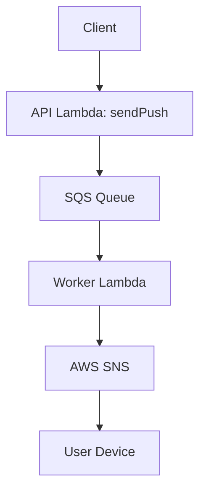

## 푸시 알림 타임아웃 문제 해결을 위한 비동기 아키텍처

## 1️⃣ 문제

동아리 회원에게 알림을 전송하기 위한 알림 서버

예상하지 못하게 알림 전송 중에 오류가 발생할 경우, 재시도로 인해 타임아웃이 발생하는 문제가 있었음.

### 기존 `sendPush` 동작 방식

```tsx
// API 요청 내에서 모든 사용자에게 알림을 보냄
const executors = users.map((user) => notificationService.platformPush(user));

// Promise.all을 통해 병렬로 실행 -> 모든 알림이 끝나야 응답 반환
// 내부적으로 실패 후, 재시도 로직을 거치는 경우 시간 초과 발생 (sns endpoint error 로 retry)
await Promise.all(executors);
```

### 문제가 된 이유

> 모든 알림 전송을 하나의 Lambda 실행에 몰아넣은 구조 때문에, 일부 네트워크 지연이 전체 타임아웃으로 이어짐.

- **Promise.all** → 모든 Promise를 동시에 실행, **전체 완료 대기**
- SNS 요청은 네트워크/재시도로 인해 수 초 이상 걸림
- **Lambda 시간 초과**

## 2️⃣ 시도했던 개선

- lambda 실행 시간 조절: 최대 20초. → 오류 상황은 줄었으나, 알림 발송량에 비해 발송 시간이 길다.
- `p-limit`:Promise를 일정 개수만큼만 동시에 실행되도록 제한하는 라이브러리
  - **→ 한계**: 타임아웃 위험 여전 (모두 끝날 때까지 기다린다는 구조 자체는 동일)

## 3️⃣ **SQS 기반 비동기 아키텍처 도입**

알림 전송을 지금 바로 끝내지 말고, 나중에 별도의 Lambda가 처리하도록 큐에 맡기자.

---

### 구조



### **→ API Lambda (`sendPush`)**

- 클라이언트로부터 알림 요청 수신
- 실제 알림 전송 대신 **SQS에 메시지 발행(Publish)**

### **→ SQS (Simple Queue Service)**

- 메시지를 안전하게 큐잉 (유실 없이 저장)
- Worker Lambda가 처리할 때까지 대기

### **→ Worker Lambda**

- SQS 메시지 수신 시 자동 실행 (이벤트 트리거)
- 실제 `notificationService.platformPush()` 수행

## 4️⃣ 구현

### API Lambda

```tsx
import { SQSClient, SendMessageCommand } from "@aws-sdk/client-sqs";

const sqs = new SQSClient({ region: "ap-northeast-2" });

export const sendPush = async (event) => {
  const message = JSON.stringify({ title, content, userIds });
  await sqs.send(
    new SendMessageCommand({
      QueueUrl: process.env.QUEUE_URL,
      MessageBody: message,
    })
  );
  return { statusCode: 202, body: "Request accepted" };
};
```

### Worker Lambda 구현

```tsx
export const handler = async (event) => {
  for (const record of event.Records) {
    const body = JSON.parse(record.body);
    await notificationService.platformPush(body);
  }
};
```
