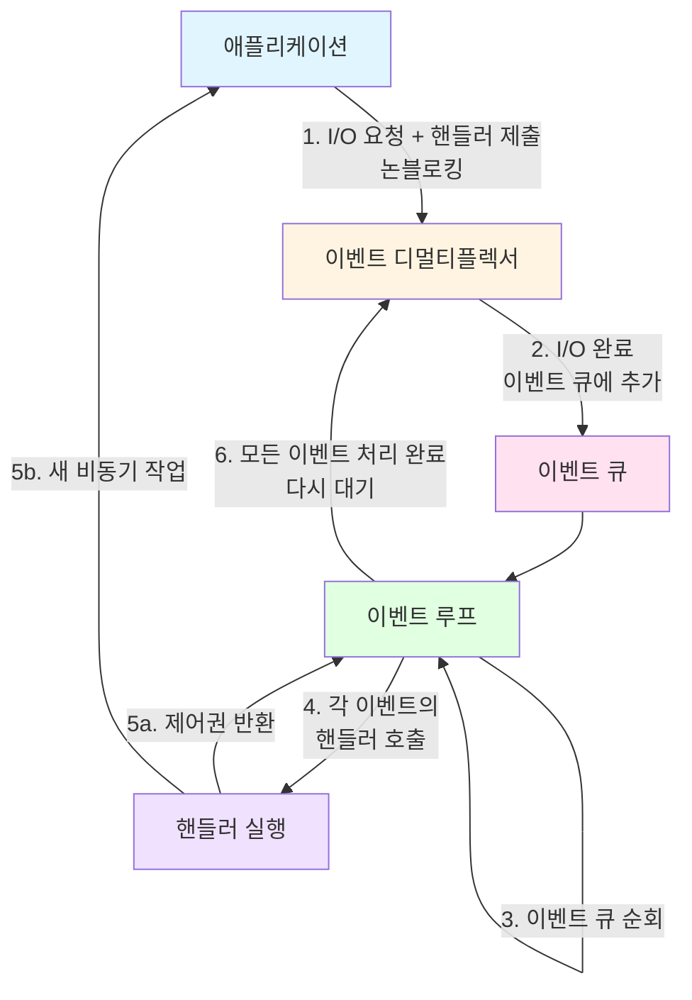

# Chapter 1: Node.js 플랫폼

> **발표자**: 길현준
> **주제**: Node.js의 철학, 작동 원리, 그리고 JavaScript

---

## 📌 목차

1. [개요](#개요)
2. [Node.js 철학](#1-nodejs-철학)
3. [Node.js는 어떻게 작동하는가](#2-nodejs는-어떻게-작동하는가)
4. [Node.js에서의 JavaScript](#3-nodejs에서의-javascript)
5. [핵심 요약](#핵심-요약)
6. [실습 코드](#실습-코드)
7. [참고 자료](#참고-자료)

---

## 개요

### 왜 이 챕터가 중요한가?

Node.js의 **철학**과 **내부 작동 원리**를 이해하는 것은 단순히 이론적 지식을 쌓는 것이 아닙니다. 이는 앞으로 배울 복잡한 디자인 패턴과 비동기 프로그래밍을 제대로 이해하기 위한 **필수 기반**입니다.

### 핵심 키워드

- **Node.js 철학**: 경량 코어, 작은 모듈, 간결함과 실용주의
- **Reactor 패턴**: Node.js 비동기 아키텍처의 핵심
- **이벤트 루프**: 단일 스레드로 동시성을 구현하는 메커니즘
- **논블로킹 I/O**: Node.js의 성능을 결정짓는 핵심 개념

---

## 1. Node.js 철학

Node.js는 단순히 기술이 아니라 **문화**이자 **철학**입니다. "Node way"라고 불리는 이 철학은 애플리케이션 설계 방식과 커뮤니티 생태계에 큰 영향을 미칩니다.

### 1-1. 경량 코어 (Lightweight Core)

**핵심 원칙**: 최소한의 기능 세트를 코어에 두고, 나머지는 유저랜드(userland)에 맡긴다.

**왜 중요한가?**

- 코어는 안정적이지만 느리게 진화
- 커뮤니티가 빠르게 실험하고 혁신할 수 있는 자유 제공
- 관리 측면에서 효율적

**실무 적용**:

```javascript
// ❌ 코어에 모든 기능을 넣는 대신
// ✅ npm 생태계에서 필요한 기능을 선택

// 코어: 기본 HTTP 서버만 제공
const http = require("http");

// 유저랜드: Express, Koa, Fastify 등에서 선택
const express = require("express"); // 웹 프레임워크는 선택
```

---

### 1-2. 경량 모듈 (Small Modules)

**핵심 원칙**: 작고 집중화된 모듈을 만들어라.

**Unix 철학 기반**:

- "작은 것이 아름답다"
- "각 프로그램은 한 가지 역할만 잘 하도록 만들어라"

**Node.js의 혁신**:

- npm/yarn을 통한 **종속성 지옥 해결**
- 각 패키지가 자신만의 종속성 버전을 가질 수 있음

**실제 예시**:

```javascript
// 극단적인 예: 이메일 정규식만 포함한 2줄짜리 패키지
// https://github.com/sindresorhus/email-regex
const emailRegex = require("email-regex");
```

**작은 모듈의 장점**:

1. ✅ 이해하기 쉽고 사용하기 쉽다
2. ✅ 테스트 및 유지보수가 간편하다
3. ✅ 브라우저에서도 사용 가능 (번들 크기 최소화)
4. ✅ 재사용성 극대화 → DRY 원칙의 새로운 차원

---

### 1-3. 작은 외부 인터페이스 (Small Surface Area)

**핵심 원칙**: 최소한의 기능만 노출하고, 명확한 단일 진입점을 제공하라.

**Best Practice**:

```javascript
// ✅ 좋은 패턴: 단일 함수/클래스만 노출
module.exports = function createServer(options) {
  // 구현...
};

// ❌ 피해야 할 패턴: 너무 많은 것을 노출
module.exports = {
  Server,
  Client,
  Protocol,
  Parser,
  Encoder,
  Decoder,
  // ... 너무 많음
};
```

**확장보다 사용을 우선**:

- 내부 구현을 숨기고 외부 인터페이스를 최소화
- 클래스보다 함수를 선호하는 이유
- 유스케이스를 줄여 유지보수성 향상

---

### 1-4. 간결함과 실용주의 (Simplicity & Pragmatism)

**KISS 원칙**: Keep It Simple, Stupid

> "단순함이야말로 궁극의 정교함이다" - 레오나르도 다빈치

**"불완전한 것이 낫다" (Worse is Better)**:

- 리차드 가브리엘의 철학
- 완벽하고 복잡한 소프트웨어보다 단순하고 실용적인 설계가 낫다

**실무에서의 의미**:

```javascript
// ❌ 복잡한 클래스 계층 구조
class AbstractFactoryBuilder {
  // 100줄의 복잡한 코드...
}

// ✅ 간단한 함수와 클로저
function createFactory(config) {
  return function create(options) {
    return { ...config, ...options };
  };
}
```

**JavaScript의 실용성**:

- 복잡한 OOP 설계 대신 단순한 함수형 접근
- 현실의 복잡성을 인정하고 합리적인 타협점 찾기

---

## 2. Node.js는 어떻게 작동하는가

### 2-1. I/O는 느리다

**성능 비교**:

| 작업                 | 속도            | 대역폭      |
| -------------------- | --------------- | ----------- |
| RAM 접근             | 나노초 (10⁻⁹초) | GB/s        |
| 디스크/네트워크 접근 | 밀리초 (10⁻³초) | MB/s ~ GB/s |

**핵심 문제**:

- CPU는 빠르지만, I/O는 느림
- 요청과 완료 사이의 **지연 시간**이 문제
- 인간의 입력(마우스 클릭 등)은 더욱 느림

→ **이 대기 시간을 어떻게 효율적으로 처리할 것인가?**

---

### 2-2. 블로킹 I/O

**전통적인 방식**:

```javascript
// 의사코드: 블로킹 방식
data = socket.read(); // 데이터가 올 때까지 스레드 블로킹
print(data); // 데이터 사용 가능
```

**문제점**:

- 하나의 I/O 작업이 전체 스레드를 차단
- 동시 연결 처리를 위해 **각 연결마다 별도의 스레드 필요**

```
[다중 스레드 모델]
연결 A → 스레드 1 → 대기 → 대기 → 처리
연결 B → 스레드 2 → 대기 → 처리 → 대기
연결 C → 스레드 3 → 처리 → 대기 → 대기
```

**비용**:

- 스레드는 메모리 소비 (각 스레드당 MB 단위)
- 컨텍스트 스위칭 오버헤드
- 대부분의 시간을 유휴 상태로 낭비

> 📊 **실습**: `code/blocking-io.js` 참조

---

### 2-3. 논블로킹 I/O

**현대적 접근**:

- 시스템 호출이 **즉시 반환**
- 데이터가 없으면 상수 반환 (예: `EAGAIN`)

**폴링 방식** (Busy-waiting):

```javascript
// 의사코드: 논블로킹 폴링
resources = [socketA, socketB, fileA];
while (!resources.isEmpty()) {
  for (resource of resources) {
    data = resource.read();
    if (data === NO_DATA_AVAILABLE) continue;
    if (data === RESOURCE_CLOSED) {
      resources.remove(resource);
    } else {
      consumeData(data);
    }
  }
}
```

**여전히 문제**:

- 사용 불가능한 리소스를 계속 체크 → CPU 낭비
- 더 나은 방법이 필요!

> 📊 **실습**: `code/non-blocking-io.js` 참조

---

### 2-4. 이벤트 디멀티플렉싱

**핵심 개념**:

- 여러 리소스를 관찰
- **준비된 리소스가 있을 때만** 알림
- 그 전까지는 효율적으로 대기

**동기 이벤트 디멀티플렉서**:

```javascript
// 의사코드
watchedList.add(socketA, FOR_READ);
watchedList.add(fileB, FOR_READ);

while ((events = demultiplexer.watch(watchedList))) {
  // 블로킹
  for (event of events) {
    // 준비된 이벤트만 처리
    data = event.resource.read(); // 논블로킹, 항상 성공
    if (data === RESOURCE_CLOSED) {
      demultiplexer.unwatch(event.resource);
    } else {
      consumeData(data);
    }
  }
}
```

**동작 과정**:

1. 각 리소스를 데이터 구조에 추가 (특정 연산과 연결)
2. `demultiplexer.watch()` - 준비된 리소스가 있을 때까지 블로킹
3. 준비된 이벤트 반환 → 각 이벤트 처리
4. 모든 이벤트 처리 후 다시 대기 → **이벤트 루프!**

**장점**:

- ✅ 단일 스레드로 여러 I/O 작업 처리
- ✅ CPU 낭비 없음 (바쁜 대기 제거)
- ✅ 효율적인 리소스 사용

```
[단일 스레드 모델]
연결 A, B, C → 단일 스레드 → A 처리 → C 처리 → B 처리 → ...
```

---

### 2-5. Reactor 패턴 ⚡ (핵심!)

**Node.js 비동기 아키텍처의 심장부**

**핵심 아이디어**:

- 각 I/O 작업에 **핸들러(콜백 함수)** 연결
- 이벤트 발생 시 해당 핸들러 호출

**Reactor 패턴 구조**:



**단계별 설명**:

1. **요청 전달**: 애플리케이션이 I/O 작업 + 완료 핸들러를 이벤트 디멀티플렉서에 전달 (논블로킹)
2. **이벤트 큐잉**: I/O 완료 시 이벤트를 이벤트 큐에 추가
3. **이벤트 순회**: 이벤트 루프가 큐의 항목들을 순환
4. **핸들러 실행**: 각 이벤트의 핸들러 호출
5. **제어권 반환**: 핸들러 완료 후 이벤트 루프로 제어권 반환, 또는 새 비동기 작업 요청
6. **반복**: 모든 이벤트 처리 후 디멀티플렉서에서 대기

**정의**:

> Reactor 패턴은 일련의 관찰 대상 리소스에서 새 이벤트를 사용할 수 있을 때까지 블로킹하여 I/O를 처리하고, 각 이벤트를 관련된 핸들러에 전달함으로써 반응합니다.

**종료 조건**:

- 이벤트 디멀티플렉서에 보류중인 작업이 없음
- 이벤트 큐에 처리 중인 작업이 없음

> 📊 **실습**: `code/reactor-pattern.js` 참조

---

### 2-6. Libuv - Node.js의 I/O 엔진

**왜 필요한가?**

각 OS마다 다른 이벤트 디멀티플렉서:

- Linux: `epoll`
- macOS: `kqueue`
- Windows: `IOCP` (I/O Completion Port)

**Libuv의 역할**:

- 크로스 플랫폼 추상화 계층 제공
- 논블로킹 동작 표준화
- Reactor 패턴 구현
- 이벤트 루프, 이벤트 큐, 비동기 I/O 작업 관리

**특별한 처리**:

- Unix에서 일반 파일시스템은 논블로킹을 지원하지 않음
- Libuv는 **별도의 스레드 풀**을 사용하여 이를 처리

> 참고: Nikhil Marathe의 무료 온라인 책
> http://nikhilm.github.io/uvbook/

---

### 2-7. Node.js 전체 아키텍처

```
┌─────────────────────────────────────────┐
│   사용자 영역의 모듈과 애플리케이션       │
└─────────────────────────────────────────┘
                   ↓
┌─────────────────────────────────────────┐
│              Node.js                    │
│  ┌─────────────────────────────────┐   │
│  │    코어 JavaScript API          │   │
│  └─────────────────────────────────┘   │
│  ┌──────────┐  ┌──────────────────┐   │
│  │ 바인딩    │  │       V8         │   │
│  └──────────┘  └──────────────────┘   │
│  ┌─────────────────────────────────┐   │
│  │          libuv                  │   │
│  └─────────────────────────────────┘   │
└─────────────────────────────────────────┘
```

**3가지 핵심 구성 요소**:

1. **바인딩**: libuv와 저수준 기능을 랩핑
2. **V8**: 구글이 개발한 JavaScript 엔진
   - 혁신적인 설계와 속도
   - 효율적인 메모리 관리
3. **코어 JavaScript 라이브러리**: 고수준 Node.js API 구현

---

## 3. Node.js에서의 JavaScript

### 3-1. 브라우저 vs Node.js

**차이점**:

| 특성             | 브라우저  | Node.js      |
| ---------------- | --------- | ------------ |
| DOM              | ✅ 있음   | ❌ 없음      |
| window, document | ✅ 있음   | ❌ 없음      |
| OS 리소스 접근   | ❌ 제한적 | ✅ 전체 접근 |
| 보안 샌드박스    | ✅ 엄격함 | ❌ 없음      |

**Node.js의 자유**:

- 파일시스템, 네트워크, 프로세스 등 OS 서비스 전체 접근
- 브라우저의 보안 제약 없음
- 악성 코드에 대한 책임은 개발자에게

---

### 3-2. 최신 JavaScript 실행

**브라우저의 고충**:

- 다양한 기기와 브라우저 버전
- 트랜스파일러(Babel), 폴리필 필요
- 모든 기능을 플러그인으로 대체 불가

**Node.js의 장점**:

- ✅ 특정 Node.js 버전에서 실행 보장
- ✅ 최신 V8 엔진 사용
- ✅ 최신 ECMAScript 기능 사용 가능
- ✅ 트랜스파일 없이 native ES 문법 사용

**Best Practice (라이브러리 개발 시)**:

```json
// package.json
{
  "engines": {
    "node": ">=18.0.0"
  }
}
```

- LTS 버전 중 가장 오래된 것을 기준으로 설정
- 패키지 매니저가 호환성 경고 제공

**참고 링크**:

- Node.js 배포: https://nodejs.org/en/about/releases/
- ES 기능 지원: https://node.green/

---

### 3-3. 모듈 시스템

Node.js는 처음부터 모듈 시스템을 제공했습니다:

**CommonJS**:
- Node.js의 원래 모듈 시스템
- `require` 키워드를 사용하여 모듈 임포트
- 파일 시스템에 위치한 모듈의 함수, 변수, 클래스를 불러옴

**ES Modules**:
- 현대 JavaScript의 표준 모듈 문법
- `import` 키워드 사용
- 브라우저와는 구현이 다르지만 문법은 동일

> 💡 **모듈 시스템에 대한 자세한 내용은 Chapter 2에서 다룹니다.**

---

### 3-4. 운영체제 기능 접근

**핵심 모듈들**:

```javascript
// 파일시스템
const fs = require("fs");
fs.readFile("file.txt", "utf8", (err, data) => {
  console.log(data);
});

// 네트워크 (TCP)
const net = require("net");
const server = net.createServer((socket) => {
  socket.write("Hello!");
});

// HTTP 서버
const http = require("http");
http
  .createServer((req, res) => {
    res.end("Hello World");
  })
  .listen(3000);

// 암호화
const crypto = require("crypto");
const hash = crypto.createHash("sha256").update("data").digest("hex");

// 자식 프로세스
const { exec } = require("child_process");
exec("ls -la", (err, stdout) => {
  console.log(stdout);
});

// 프로세스 정보
console.log(process.env.NODE_ENV);
console.log(process.argv);
```

**참고**: Node.js 공식 문서 https://nodejs.org/en/docs/

---

### 3-5. 네이티브 코드 실행

**N-API**:

- C/C++ 코드를 Node.js에서 실행 가능
- 기존 C/C++ 라이브러리 재사용
- 레거시 코드 활용

**WebAssembly (WASM)**:

- C++, Rust 등을 JavaScript VM이 이해할 수 있는 형식으로 컴파일
- 고성능 CPU 집약적 작업에 유용

**활용 사례**:

- IoT (사물인터넷)
- 로보틱스
- CPU 집약적 데이터 처리
- 하드웨어 드라이버 접근

> 참고: https://webassembly.org/

---

## 핵심 요약

### 🔑 주요 개념

1. **Node.js 철학**

   - 경량 코어 + 풍부한 생태계
   - 작고 집중화된 모듈
   - 간결함과 실용주의

2. **Reactor 패턴**

   - 이벤트 디멀티플렉싱 + 이벤트 루프
   - 단일 스레드로 동시성 구현
   - 논블로킹 I/O의 핵심

3. **Node.js 아키텍처**

   - V8 (JavaScript 엔진)
   - libuv (이벤트 루프, 크로스 플랫폼 I/O)
   - 코어 JavaScript API

4. **JavaScript의 차이**
   - 브라우저와 다른 실행 환경
   - OS 전체 접근 권한
   - 최신 ECMAScript 기능 사용

### 💡 실무 적용 포인트

1. **비동기 프로그래밍 이해**

   - 콜백, 프라미스, async/await의 기반 이해
   - 이벤트 루프를 고려한 코드 작성

2. **모듈 설계**

   - 작고 집중화된 모듈 만들기
   - 명확한 인터페이스 제공

3. **성능 최적화**

   - 논블로킹 I/O 활용
   - CPU 집약적 작업은 별도 처리

4. **플랫폼 특성 활용**
   - Node.js 버전별 기능 파악
   - 적절한 모듈 시스템 선택

### 🔗 다음 챕터 연결

**Chapter 2: 모듈 시스템**

- CommonJS vs ES Modules 상세
- 모듈 패턴과 Best Practice
- 의존성 관리

---

## 실습 코드

모든 코드 예제는 `code/` 디렉토리에 있습니다:

### 1. 블로킹 vs 논블로킹 I/O 비교

```bash
node code/blocking-io.js
node code/non-blocking-io.js
```

### 2. Reactor 패턴 구현

```bash
node code/reactor-pattern.js
```

### 3. 이벤트 루프 동작

```bash
node code/event-loop-demo.js
```

### 4. 모듈 시스템 예제

```bash
node code/module-examples/commonjs-example.js
node code/module-examples/esm-example.mjs
```

---

## 참고 자료

### 공식 문서

- [Node.js 공식 문서](https://nodejs.org/en/docs/)
- [libuv 문서](http://docs.libuv.org/)
- [V8 엔진](https://v8.dev/)

### 추가 학습

- [Libuv 온라인 책](http://nikhilm.github.io/uvbook/) - Nikhil Marathe
- [Node.js 디자인 패턴 바이블](https://www.nodejsdesignpatterns.com/)
- [소프트웨어 개발 철학 목록](https://en.wikipedia.org/wiki/List_of_software_development_philosophies)

### Node.js 배포 및 호환성

- [Node.js 릴리스](https://nodejs.org/en/about/releases/)
- [Node.js ES 기능 지원](https://node.green/)
- [WebAssembly](https://webassembly.org/)

---

**마무리**: 이 챕터를 통해 Node.js의 철학과 내부 동작 원리를 이해했습니다. 다음 챕터에서는 모듈 시스템을 더 깊이 탐구하며, 이번에 배운 개념들이 실제로 어떻게 활용되는지 살펴보겠습니다.
